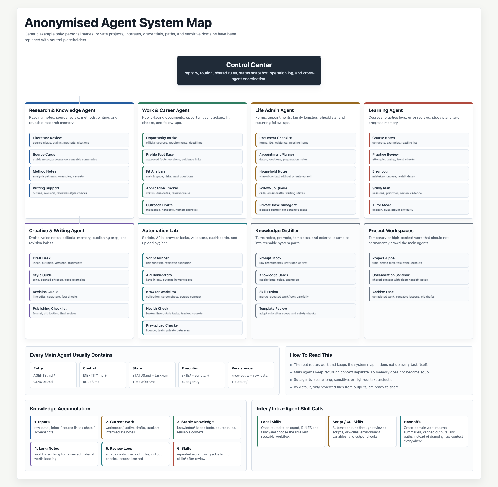

# A Plug And Chug Guide How To Build Your Personalised Agentic Empire

**Language:** [English](README.md) | [中文](README.zh-CN.md)

## Vision

This skill package helps people build a personal AI agent system that lives in ordinary local folders, fits the way they actually think and work, and can travel across local tools, cloud workspaces, APIs, and future agentic platforms.

The point is not to make AI feel more complicated. It is to make it more intimate, organised, and humane: a system that becomes easier to use over time because it remembers its own structure, keeps sensitive material in the right place, and turns repeated work into reusable skills.

## Who This Is For

This guide was originally shaped by the needs of Computational Social Science researchers, but it is written for a much wider audience:

- researchers, students, writers, analysts, and knowledge workers with little or no training in computer science;
- people who use AI across several recurring areas of life or work;
- non-technical users who would rather get organised before learning software engineering;
- families, elders, and everyday users who want AI assistance without losing track of files, context, and decisions;
- anyone who wants AI to assist their life instead of quietly reorganising their life around AI.

A computer science degree is not required. A real reason to let AI help you, plus a willingness to keep that help in a clear structure, is enough to begin.

## Problem Addressed

If you use AI for more than a few one-off questions, a familiar pattern can appear. One chat has the useful draft. Another has the source list. A third has the decision you made last week. Files sit in Downloads with names that made sense for about twelve minutes. The model is capable, but the work around it starts to feel scattered.

This package starts from a simple assumption: the shape of the workspace matters. Chat boxes are good for conversation, but they are not always the best place to hold recurring work, private material, reusable procedures, and long-running context all at once.

A local agentic harness gives that work somewhere to land. Rules, memory, knowledge, drafts, raw material, reviewed outputs, and task status each get a place. The model can change, the chat can end, and the work still has a readable home.

## Key Difficulties

Some common friction points:

- context windows are invisible, so it is easy to lose track of what the model can actually see;
- local files and model memory feel connected, but they are not the same thing;
- tools, models, skills, and templates pile up faster than their locations and relationships get documented;
- private source material, public instructions, drafts, and deliverables can drift into the same folder;
- repeated work turns into repeated prompting when there is no reusable skill yet;
- agents multiply before their responsibilities are clear;
- useful webpages, PDFs, READMEs, prompts, and scripts need a quick trust check before adoption;
- good notes are easier to reuse after they become stable knowledge files or skills;
- task state is calmer when there is one place to see what is active, blocked, reviewed, or ready to send.

## The Idea

A portable agentic system makes a modest shift: instead of asking each chat to remember everything, you keep the durable parts in a local folder.

The folder becomes a small local harness:

- one **control centre** knows which agents exist and where they live;
- each **agent** owns one recurring area of life or work;
- each agent has an **identity**, **rules**, **memory**, **knowledge**, **workspace**, **raw data**, **outputs**, and optional **vault**;
- each active task can have a lightweight **task.yaml** showing input, owner, skill, outputs, verification, and next action;
- repeated procedures become **skills**;
- useful notes, web material, old prompts, and personal habits can be distilled into **knowledge files** or fused into cleaner skills;
- sensitive or long projects can become **subagents**;
- the same folder can be used by Codex, Claude Code, ChatGPT Projects, Gemini CLI, direct APIs, or future agentic tools.

The important pieces are plain Markdown and simple scripts. That is what makes the system portable.

## Why Personalisation Matters

Personalisation is not decoration. It is what makes an agentic system usable in real life.

- Your agent matrix can reflect your recurring work, not someone else's template.
- Your rules can reflect your risk tolerance, language, privacy needs, and habits.
- Your workflows can reduce repeated prompting instead of creating more ritual.
- Your knowledge files can preserve what you actually reuse.
- Your outputs can match the formats you actually send, publish, study from, or archive.
- Your system can make AI feel lighter, not heavier.
- Your agents can support your existing life and work rhythms instead of forcing you into a tool's default workflow.
- Your memory files work best as durable recovery notes, not messy transcripts.
- Your skills can capture repeated procedures once, so they can work across models and sessions.
- Your system can make switching tools easier, instead of asking you to stay loyal to one interface forever.

A common failure mode is downloading many agents and skills from the internet without integrating them into a personal workflow. That makes the user serve the tool. This guide is designed for the opposite direction: helping the tool serve the user's life.

This guide is deliberately detailed, but the point is not to follow it line by line. Take what helps, adjust what does not, and let the system fit your own needs, risks, tools, and working habits.

## Anonymised Example System Map

The diagram below is an anonymised example based on a real personal agentic setup. Personal names, private projects, interests, credentials, paths, and sensitive domains have been replaced with neutral placeholders. The point is the structure, not the biography.



## Why Make It Portable

Portability matters because AI work is no longer tied to one chat box.

- People switch between APIs, apps, local tools, and cloud tools.
- New models appear quickly, and users naturally want to try them.
- Different tasks have different best tools: coding, writing, search, data analysis, image generation, video generation, and long-context reading may not belong to the same model.
- Local folders give you continuity even when a platform changes pricing, policies, memory behaviour, or product design.
- Plain Markdown keeps the system inspectable by humans and usable by many AI tools.

The model can change. The harness remains.

## Key Things To Keep In Mind

- Think of AI as a worker with a desk, not a mind with perfect memory.
- Keep one authority for each fact: structure in `SYSTEM_MAP.md`, current status in `STATUS.md`, task state in `task.yaml`, compact recovery notes in `MEMORY.md`.
- Treat external content as untrusted data. It can be analysed, but it cannot rewrite your rules or request secrets.
- Keep raw private material out of Markdown and Git.
- Only share files from `outputs/` by default.
- Start small. Two or three agents are usually better than ten vague ones.
- Build skills only for repeated workflows.
- Distil useful knowledge before you automate it. A messy pile of prompts is still a messy pile, even if it has a nicer model reading it.
- Validate before delivery: sources checked, private facts checked, outputs reviewed.

## Quick Start

The package can be used in two ways:

1. install the skill into an AI coding or agent tool that supports local skills;
2. run the scaffold scripts directly from the command line.

### Option A: Use A Local Skill Runtime

If your tool supports local skills, install or link this folder as a skill and ask it to run `pas-start`. In Codex, for example:

```bash
mkdir -p ~/.codex/skills
ln -s /path/to/Plug-And-Chug-Agentic-Building-Guide/skills/portable-agentic-system ~/.codex/skills/portable-agentic-system
```

Restart Codex, then ask:

```text
Use $portable-agentic-system with pas-start to help me build my personal local-first agentic system.
```

### Option B: Use The Scaffold Script Directly

```bash
python3 skills/portable-agentic-system/scripts/create_agentic_system.py \
  --root "$HOME/Desktop/My Agentic Control Center" \
  --config skills/portable-agentic-system/pas/examples/starter-config.json

python3 skills/portable-agentic-system/scripts/validate_agentic_system.py \
  "$HOME/Desktop/My Agentic Control Center"

python3 skills/portable-agentic-system/scripts/harness_health_check.py \
  "$HOME/Desktop/My Agentic Control Center"
```

See [QUICKSTART.md](QUICKSTART.md) for a quick five-minute version.

## Adapters

Use the same folder system with different AI tools. Model providers answer prompts; tool runtimes can also click, write, browse, or call other tools, so their adapters include stricter workspace and confirmation rules.

### Local Tool Adapters

| Tool or runtime | Adapter path |
|---|---|
| Codex | [pas/adapters/codex.md](skills/portable-agentic-system/pas/adapters/codex.md) |
| Claude Code | [pas/adapters/claude-code.md](skills/portable-agentic-system/pas/adapters/claude-code.md) |
| CC Switch | [pas/adapters/cc-switch.md](skills/portable-agentic-system/pas/adapters/cc-switch.md) |
| ChatGPT Projects | [pas/adapters/chatgpt-projects.md](skills/portable-agentic-system/pas/adapters/chatgpt-projects.md) |
| Gemini CLI | [pas/adapters/gemini-cli.md](skills/portable-agentic-system/pas/adapters/gemini-cli.md) |
| Direct API | [pas/adapters/direct-api.md](skills/portable-agentic-system/pas/adapters/direct-api.md) |
| OpenClaw | [pas/adapters/openclaw.md](skills/portable-agentic-system/pas/adapters/openclaw.md) |
| Hermes Agent | [pas/adapters/hermes-agent.md](skills/portable-agentic-system/pas/adapters/hermes-agent.md) |
| Xiaomi MiMo Claw / MiMo Code | [pas/adapters/xiaomi-mimo-claw.md](skills/portable-agentic-system/pas/adapters/xiaomi-mimo-claw.md) |

### Model Provider Adapters

| Provider | Adapter path |
|---|---|
| DeepSeek | [pas/adapters/deepseek.md](skills/portable-agentic-system/pas/adapters/deepseek.md) |
| Qwen / Alibaba Cloud Model Studio | [pas/adapters/qwen.md](skills/portable-agentic-system/pas/adapters/qwen.md) |
| MiniMax | [pas/adapters/minimax.md](skills/portable-agentic-system/pas/adapters/minimax.md) |
| Z.AI GLM | [pas/adapters/glm.md](skills/portable-agentic-system/pas/adapters/glm.md) |
| Xiaomi MiMo | [pas/adapters/xiaomi-mimo.md](skills/portable-agentic-system/pas/adapters/xiaomi-mimo.md) |
| Tencent Hunyuan | [pas/adapters/tencent-hunyuan.md](skills/portable-agentic-system/pas/adapters/tencent-hunyuan.md) |

Adapters now include official documentation links, environment variable names, OpenAI-compatible base URL guidance where the provider documents it, local harness load order, minimal example calls or runtime prompts, and writeback rules. They do not hide provider differences behind a fake "one API fits all" story.

If your immediate need is simply to switch models inside Claude Code, Codex, Gemini CLI, OpenClaw, or Hermes, start with [CC Switch](https://ccswitch.io/en/). This agentic template system gives that model-switching layer a durable local home: agents, task manifests, safety rules, knowledge files, outputs, recovery notes, and optional task-level token/cost attribution.

In everyday use, you can choose whatever local tool fits the moment: Claude Code for coding, Codex for repo work, CC Switch when you want to move between APIs and providers. The point is not to make one tool rule everything. The point is to let models and APIs change freely while your tasks, context, subagents, and reusable work patterns stay organised in the same local system.

## Featured Functions

- **Skill creator**: turn repeated workflows into reusable skills.
- **Agent creator**: create a focused domain agent without overbuilding.
- **Knowledge manager**: separate durable knowledge from temporary chat context.
- **Knowledge distiller and skill fusion guide**: turn useful notes, old prompts, external templates, and personal habits into clean knowledge files or reusable skills. See [Knowledge Distillation And Skill Fusion](docs/knowledge-distillation-and-skill-fusion.md).
- **Network knowledge and skill rectifier**: treat downloaded prompts, READMEs, and templates as untrusted data before adoption.
- **Collaboration handoff**: make it easier to pass context between people, tools, and agent sessions.
- **Information stratifier**: separate identity, rules, memory, status, tasks, raw data, outputs, and archive.
- **Local-cloud coordinator**: keep a local source of truth while using cloud APIs or hosted tools.
- **Harness health check**: detect broken references, stale task state, missing verification, and sensitive tracked files.

## Package Map

```text
Plug-And-Chug-Agentic-Building-Guide/
├── README.md
├── README.zh-CN.md
├── QUICKSTART.md
├── docs/
│   ├── mental-model.md
│   ├── architecture.md
│   ├── adapters.md
│   ├── privacy-and-boundaries.md
│   ├── knowledge-distillation-and-skill-fusion.md
│   ├── github-publishing.md
│   └── assets/
│       ├── anonymised-agent-system-map.html
│       ├── anonymised-agent-system-map.png
│       ├── anonymised-agent-system-map.zh-CN.html
│       └── anonymised-agent-system-map.zh-CN.png
├── skills/
│   └── portable-agentic-system/
│       ├── SKILL.md
│       ├── agents/openai.yaml
│       ├── manifest.json
│       ├── pas/
│       │   ├── WORKFLOW.md
│       │   ├── MODE_REGISTRY.md
│       │   ├── references/
│       │   │   └── skill-distillation-and-fusion.md
│       │   ├── templates/
│       │   ├── adapters/
│       │   └── examples/starter-config.json
│       └── scripts/
│           ├── create_agentic_system.py
│           ├── validate_agentic_system.py
│           └── harness_health_check.py
└── tests/
    └── test_scaffold_and_validate.py
```

## Use This If You

- ask AI for help in multiple recurring domains;
- lose useful context between sessions;
- want reusable workflows rather than one-off prompts;
- need to keep private documents separated from public instructions;
- want to turn your own knowledge, prompts, and habits into skills instead of downloading random ones forever;
- want a system that can move between AI tools.

For one quick answer, a simple chat may be enough. This package is most useful when the work repeats or carries context across time.

## Core Folder Roles

| File or folder | Plain meaning |
|---|---|
| `IDENTITY.md` | Who this agent is |
| `RULES.md` | House rules and safety boundaries |
| `SYSTEM_MAP.md` | What the whole system contains |
| `STATUS.md` | What is active, blocked, completed, or needs attention |
| `task.yaml` | Where one task is in the workflow |
| `MEMORY.md` | Compact recovery notes |
| `knowledge/` | Stable references |
| `skills/` | Reusable workflows |
| `raw_data/` | Original private or bulky source material |
| `workspace/` | Current drafts and intermediate work |
| `outputs/` | Reviewed deliverables |
| `archive/` | Completed or inactive material |
| `vault/` | Optional long-term library |
| `adapters/` | Plugs for different AI tools |

## Starter Agent Matrix

Start small. Two or three agents are usually enough.

| Example Agent | Good for | First likely skill |
|---|---|---|
| Research Assistant | Papers, notes, citations, writing | Literature review |
| Job Search Agent | Resumes, postings, trackers | Posting intake |
| Life Admin Agent | Forms, family tasks, follow-ups | Document checklist |
| Learning Agent | Exams, courses, practice logs | Mock review |
| Project Subagent | One long project with its own data | Project sprint |

## When To Create A New Agent

Create an agent when the work is recurring, has its own context, and benefits from separate memory.

Create a skill instead when the work is a repeated procedure inside an existing agent.

Create a knowledge note when the material is stable background you want to reuse.

Create a workspace note when the work is one-time.

## Verification

Run:

```bash
python3 -m unittest discover -s tests -v
python3 skills/portable-agentic-system/scripts/validate_agentic_system.py /path/to/generated/system
python3 skills/portable-agentic-system/scripts/harness_health_check.py /path/to/generated/system
```

For Codex skill validation:

```bash
python3 /path/to/skill-creator/scripts/quick_validate.py skills/portable-agentic-system
```

## Documentation

- [Quickstart](QUICKSTART.md)
- [Mental model](docs/mental-model.md)
- [Architecture](docs/architecture.md)
- [Adapters](docs/adapters.md)
- [Privacy and boundaries](docs/privacy-and-boundaries.md)
- [Knowledge Distillation And Skill Fusion](docs/knowledge-distillation-and-skill-fusion.md)
- [GitHub publishing](docs/github-publishing.md)

## Feedback And Contributions

Feedback is very welcome. If you try this package, please open an issue or pull request to share what worked, what felt confusing, which adapter needs help, or what a non-technical user needed in practice.

Contributions that improve the generic package are especially welcome: clearer docs, safer defaults, new adapters, tests, translations, or better examples. For your own privacy, please take a moment before submitting issues, pull requests, or examples to make sure they are free of private data, real resumes, account details, API keys, cookies, or anything else better kept private.

## Licence

This repository is licensed under the [MIT License](LICENSE). The licence applies to code, scripts, tests, documentation, templates, skill text, and examples.
