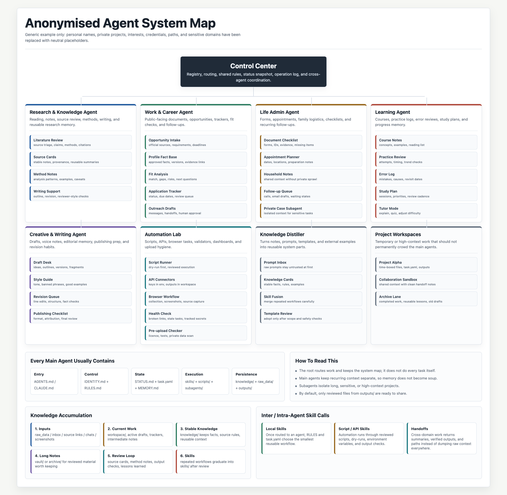

# Plug & Chug

<a id="understand-ai-agents-build-a-working-system-that-fits-your-life"></a>
## A practical guide to AI Agents and personal workspaces

[English](README.md) | [中文](README.zh-CN.md) · [Start here](docs/start-here.md) · [Handbook](docs/handbook/index.md) · [English PDF](docs/downloads/Agentic-System-Building-Guide.pdf) · [中文 PDF](docs/downloads/Agentic-System-Building-Guide.zh-CN.pdf)

Why build a local agentic system when Codex, Claude Code or WorkBuddy can already do so much?

This project began with the needs of Computational Social Science researchers. A research report develops over time: you select sources, revise an argument and reject unsupported claims. To pick it up next week, you need the draft, the reasons for those decisions and a clear account of what remains unresolved. Similar needs arise when studying, preparing a class or managing other recurring work.

**Plug & Chug explains how to organise that work with the AI assistant you already use.** The handbook develops the concepts through a small task; the toolkit provides files and procedures you can adapt. The guided setup requires no programming background.

The starting point can be an ordinary project folder. Agree with your assistant which task-approved materials it may read, where the current draft belongs and how to record progress. With file access and your agreement, it can consult those records, update the draft and leave a handoff. When you return, have it read the relevant files before continuing.

You also choose which methods and confirmed preferences to retain. Keeping them in files you control lets you inspect, revise and back them up, or take them to another app and check how it uses them. This complements the project and memory features of your existing assistant. For an occasional question, that app may already be enough. Build a small workspace when it helps with recurring work, and judge it by how much repeated explanation and searching it saves.

## Understand what the model does, and what your system keeps

The company diagram separates the responsibilities. You are the owner who sets the purpose, controls the materials and decides what counts as a useful result. The model does the reasoning. An Agent gives that work a role, instructions and available tools. The **harness** is the configured environment around execution: your existing app can supply the runtime and tools, while your files retain the records and methods for the work.


[Open the concept map as SVG](docs/assets/harness-concept-map.svg) · [Follow the explanation in the textbook](docs/handbook/en/00-foundations.md)

Think of the AI workspace as a **whiteboard with limited space**. Your prompt, the portions of files actually read and the results returned by tools add material to the board. What is on it now forms the model's **active context** for the next response. A saved chat transcript may contain more than the board currently holds.

To make room, the app can summarise important material and replace longer passages with that summary. This is **compaction**, often shown as “compacting”. Erasing the board in this analogy means removing material from active context; the saved transcript may remain. A summary helps the work continue, but details can be lost, so keep important evidence where it can be checked again.

For the ongoing report, put a **task notebook** beside the board. Record checked decisions, open questions, source paths and the next step in a brief or handoff. This guide uses **short-term task memory** for the current conversation and records that support the same unfinished task. Reading the notebook after compaction or in a new session restores the relevant progress to the board. Archive the task records when the work is finished.

Keep material worth reusing in a **filing cabinet you control**: source documents, reviewed knowledge, preferences you explicitly choose to retain and useful methods. These form **long-term documentary memory** across tasks, and remain open to review and revision. Retrieve the relevant material for each task rather than empty the whole cabinet onto the board. Short and long describe the records' purpose and retention here; apps may use different terms and implementations.

Project instructions act like **standing reminders pinned beside the board**, or an SOP for the worker. They state the project's purpose, requirements and checks. Put them in the instruction entrypoint your app is configured to read, then verify that it loads them. Other documents can stay in the cabinet until needed; the `.md` extension alone does not make a file an always-loaded instruction.

A **Skill is a task-specific sticky note** kept ready for a recurring kind of work. If a literature comparison works well repeatedly, ask your assistant to write down when to use it, how to separate source claims from your interpretation and how to check the result. Package that method in `SKILL.md`, with references or scripts where useful. When a matching task comes up, a compatible app can bring the note into active context to guide the work; check that it actually loads it. Creating a Skill records a method without training model weights or automatically adding tools or permissions. The [Skill chapter](docs/handbook/en/04-skills.md) teaches the process; the [Agent Skills specification](https://agentskills.io/specification) defines the format.

The board can become difficult to use even before it is full. Long or cluttered context can weaken retrieval and reasoning, often called **[context rot](https://www.trychroma.com/research/context-rot)**; the effect varies by task and model. Standing reminders and task-specific methods also take up space. Anthropic's [context engineering article](https://www.anthropic.com/engineering/effective-context-engineering-for-ai-agents) explains compaction, working notes and selective retrieval.

File formats serve different purposes. A `.md` file is plain text with Markdown headings, lists and links, suitable for notes you can read and edit. JSON and YAML organise settings or records into fields for tools to consume. Scripts contain executable steps for calculations or checks; they take effect when run. You can begin with prose and ask your assistant to help adapt templates or scripts as needed.

## Handbook and practice

The handbook follows a comparison of three fictional venues. Maple Studio has room for the group and suitable evening hours, but its note says nothing about step-free entry. That missing fact affects the recommendation and must remain visible in the saved result. You review the comparison against the supplied notes, keep the checked version distinct from the draft, and use a handoff to continue in another session.

**[Read the Chinese textbook PDF](docs/downloads/Agentic-System-Building-Guide.zh-CN.pdf) · [Read the English textbook PDF](docs/downloads/Agentic-System-Building-Guide.pdf) · [Browse the chapters](docs/handbook/index.md)**

| A question you meet while working | Read alongside the step |
|---|---|
| What can the model actually see and do? | [Introduction](docs/handbook/en/00-introduction.md) · [How an Agent works](docs/handbook/en/00-foundations.md) |
| How can I complete and check one useful task? | [First task](docs/handbook/en/01-first-task.md) · [Guided setup](docs/start-here.md) |
| What must stay when the conversation ends? | [Workspace](docs/handbook/en/02-workspace.md) · [Continuing across sessions](docs/handbook/en/03-resume.md) |
| When should a method or a role become reusable? | [Skills](docs/handbook/en/04-skills.md) · [Agent responsibilities](docs/handbook/en/05-agents.md) |
| How do I change tools and keep improving? | [Portability](docs/handbook/en/06-portability.md) · [Verification](docs/handbook/en/07-verification.md) · [Maintenance](docs/handbook/en/08-maintenance.md) |

Use the book alongside your assistant: read the explanation, try the step and return to the relevant chapter when something is unclear. The PDFs cover the core material. Newer guidance on source indexes, preference records and model acceptance appears in the online guides below. The [English](docs/agentic-systems-field-guide.md) and [Chinese](docs/agentic-systems-field-guide.zh-CN.md) editions also provide continuous online reading.

The [first-project exercise](examples/first-project/README.md) supplies the venue notes, task brief and reference answers; you create the working files during the exercise. You can use it to practise source review, saving a checked result and resuming from a handoff before introducing your own materials. If you already have a suitable task, begin with that; the exercise is optional.

[Start the exercise](docs/start-here.md#practice-first) · [Reference comparison](examples/first-project/expected/comparison.md) · [Reference handoff](examples/first-project/expected/handoff.md)

<a id="start-with-your-ai"></a>
## Let your existing assistant help you set it up

Open your usual AI app and give it the prompt below. Its first job is to understand the task and check what it can actually access, then propose a new folder and explain what it will put there. Review that proposal before agreeing to file creation. A chat-only assistant can explain a step for you to perform; it should report that limit. The [beginner guide](docs/start-here.md) covers the setup conversation, and the [manual standard route](QUICKSTART.md#manual-standard-scaffold) provides commands for readers who prefer them.

<!-- STARTING_PROMPT:en -->
```text
I don't know how to program. Please use this repository to help me build
my own local agentic system:
https://github.com/kwis7/Plug-And-Chug-Agentic-Building-Guide

Start with the beginner guide. Ask what I want help with, which AI app
I use, and what computer I have. Ask only two or three questions at a time.
Recommend the simplest useful setup for my work and explain it plainly.
Handle the technical steps you can actually perform. Before creating files,
show me the new folder and what you will put there, then wait for my agreement.
Use a new folder and preserve my existing files.
Help me complete one small task, check the result, and try continuing in
a new conversation. Finish with a short note explaining where my files are,
what to open next time, and what to ask you to do.
If you cannot read the repository or work with local files, explain the
one next step I need to take instead of claiming the setup is complete.
```
<!-- /STARTING_PROMPT -->

For the first task, ask why each proposed file is needed. Review the saved result against its sources, and leave a short next-use card with the actual file paths. Then try the card in a new conversation. That attempt will show whether the files and instructions are enough to recover the work, or whether something needs changing.

[Save the starting prompt](skills/portable-agentic-system/pas/references/friend-starter-prompt.md#english) · [Questions your AI will ask](skills/portable-agentic-system/pas/references/intake-questions.md) · [Full facilitator protocol](skills/portable-agentic-system/pas/references/facilitation-protocol.md)

<a id="let-the-system-become-yours-through-use"></a>
## Personalisation and maintenance

Repeated work reveals what is worth retaining. A writer may need tone and revision decisions alongside the draft. A researcher may need the evidence behind an argument. You can choose the language, formats and standards for that work, then revise the arrangement when those needs change.

As more material accumulates, you need to know which version is current, where it came from and whether the assistant may use it for the task. The [local workspace guide](docs/reference/local-workspace.md) explains source indexes and working copies that record those answers. Personal originals stay under your control. Provide only authorised minimum fields, an explicitly agent-readable redacted derivative or controlled mediator output; [Privacy and boundaries](docs/reference/privacy-and-boundaries.md) explains the options.

A repeated correction calls for a different decision: should this apply to future work, and with what scope? The [personalisation guide](docs/reference/personalization-and-evolution.md) shows how to retain an explicit choice and later revise or withdraw it. A procedure worth repeating can become a Skill, stable background belongs in knowledge, and current progress belongs with the task. The textbook's [personalisation explanation](docs/handbook/en/00-foundations.md#personalise-the-work-explicitly) explains why separating these uses helps retrieval and maintenance.

Changing a model or app tests another aspect of the design. Keep the working material and try the new combination on a small task: observe instruction loading, required tool use, treatment of unknowns and recovery of the next step. The [model portability guide](docs/reference/model-portability.md) describes the evidence to record. The [fictional long-term workspace](examples/long-term-workspace/README.md) combines source records, a chosen preference and a handoff. Its acceptance plan is an illustration and remains unrun until someone actually performs the checks.

<a id="when-the-work-grows-use-this-map-to-think-about-responsibilities"></a>
## Separate responsibilities when the work requires it

One role may be sufficient for your work. If another area has a different owner, source scope or set of rules, separating responsibilities can make those boundaries easier to manage. The diagram shows one anonymised larger system with a coordinator, roles that use their own context, and shared methods. Separate role names or folders still need appropriate permissions; they do not create isolation by themselves.



[Open the example system map as SVG](docs/assets/anonymised-agent-system-map.svg) · [Architecture reference](docs/reference/architecture.md)

Read the map in terms of ownership: who controls the inputs, who is responsible for the result, and what can be reused elsewhere? A research checklist may help a writing task without transferring the private sources from which it was developed. The toolkit's `pas-borrow` and `pas-distill` modes support this reuse, with boundaries explained in the [method-sharing guide](docs/reference/cross-agent-skill-borrowing.md). Add the roles your work calls for; the whole organisation chart is only an example.

<details>
<summary>How the standard workspace keeps different kinds of work</summary>

| Place | What belongs there |
|---|---|
| `AGENTS.md`, `RULES.md` | The instructions and working boundaries relevant to this project |
| `MEMORY.md` | A short recovery note and pointers to what matters next |
| `knowledge/` | Stable reference material worth retrieving again |
| `skills/` | Reusable procedures, with a clear reason to load each one |
| `tasks/`, `workspace/` | Current task state and work in progress |
| `raw_data/` | Public or synthetic inputs and authorised derivatives for the task; personal originals remain outside the Agent's read scope |
| `outputs/` | Reviewed results; storing something here does not send or publish it |
| `STATUS.md` | An overview generated from task records |

The [filesystem contract](skills/portable-agentic-system/pas/references/filesystem-contract.md) explains the full structure, including manifests, intermediate artifacts, logs and archives. The [file-role guide](docs/reference/file-roles.md) is a shorter introduction.

<details>
<summary>See the standard generated folder structure</summary>

```text
My Agent Workspace/
├── AGENTS.md / CLAUDE.md / GEMINI.md
├── IDENTITY.md / RULES.md / SYSTEM_MAP.md
├── MEMORY.md / STATUS.md
├── routing-evals.json / runtime-compatibility.json
├── .codex/ / .claude/ / .gemini/     Runtime configuration
├── .pas/bin/                       Local checks and gates
├── tasks/ / workspace/             Current work
├── knowledge/ / skills/             Reusable material and methods
├── raw_data/ / artifacts/ / logs/   Named inputs and working records
├── outputs/ / archive/             Reviewed and closed work
└── example-Agent/                  A role with its own files and workspace
```

This is the full standard scaffold. The guided conversation may instead create a smaller teaching workspace. That separate approach is not an undocumented minimal-generator mode.

</details>

</details>

<a id="toolkit-features"></a>
## Find the function you need

The table below points to specific operations, from generating a workspace to reviewing an existing one. Use it to find the relevant instructions for a task.

<details>
<summary>Explore the functions and their entry points</summary>

| I want to… | What the toolkit provides | Direct entry |
|---|---|---|
| Build my first personal system | A staged conversation and a proposed design | [Starting prompt](skills/portable-agentic-system/pas/references/friend-starter-prompt.md) · [Questionnaire](skills/portable-agentic-system/pas/references/intake-questions.md) |
| Create the standard folder structure | A generator, starter configuration and templates | [Setup commands](QUICKSTART.md#manual-standard-scaffold) · [Generator](skills/portable-agentic-system/scripts/create_agentic_system.py) · [Configuration](skills/portable-agentic-system/pas/examples/starter-config.json) |
| Check an existing system | Structure, file-budget, routing and status checks | [Health checker](skills/portable-agentic-system/scripts/harness_health_check.py) · [Review guide](docs/reference/system-review-and-renewal.md) |
| Add an Agent or a Skill | Decide what needs a separate role and write a usable trigger | [Routing and role checks](skills/portable-agentic-system/pas/references/description-routing-evals.md) · [Skill template](skills/portable-agentic-system/pas/templates/skill/SKILL.md) |
| Keep methods that worked | Turn repeated procedures and corrections into reusable material | [Skill distillation](docs/reference/knowledge-distillation-and-skill-fusion.md) |
| Let Agents share methods | Borrow a procedure while keeping each owner's inputs separate | [Cross-agent method sharing](docs/reference/cross-agent-skill-borrowing.md) |
| Track work and check completion | Task records, generated status, receipts and completion gates | [Task and gate guide](docs/reference/task-lifecycle.md) · [Status generator](skills/portable-agentic-system/scripts/generate_status.py) |
| Control context and concurrent work | Memory/file budgets, resource locks and worktree guidance | [Budget checker](skills/portable-agentic-system/scripts/check_budgets.py) · [Locks and concurrency](skills/portable-agentic-system/pas/references/textbook-reliability.md) |
| Change AI software or model provider | Runtime adapters and separately recorded support levels | [Adapter guide](docs/reference/compatibility.md) · [Adapter selection](skills/portable-agentic-system/pas/references/adapters.md) |
| Clean up and improve after use | Review stale instructions, noisy memory and overlapping methods | [Review and renewal](docs/reference/system-review-and-renewal.md) |

The [installable Skill](skills/portable-agentic-system/SKILL.md) brings these workflows together. Its named modes include `pas-start`, `pas-audit`, `pas-adapt`, `pas-add-agent`, `pas-create-skill`, `pas-distill`, `pas-borrow` and `pas-review`; they are requests to a supporting assistant, not terminal commands.

</details>

<a id="technical-setup"></a>
## Optional: install the Skill or run the toolkit yourself

These commands are an alternative to guided setup. They also let you inspect the steps your assistant may use.

<details>
<summary>Show installation and workspace generation steps</summary>

Run these Bash/Zsh examples only after replacing the example paths with your chosen locations.

### Install the Skill

After obtaining a local copy of this repository, run from the project where you want to use the Skill. For a Codex-compatible project location:

```bash
mkdir -p .agents/skills
ln -s /path/to/Plug-And-Chug-Agentic-Building-Guide/skills/portable-agentic-system \
  .agents/skills/portable-agentic-system
```

For a personal location, use `"$HOME/.agents/skills"` as the destination instead. Read the matching adapter for discovery and loading details: [Codex](skills/portable-agentic-system/pas/adapters/codex.md), [Claude Code](skills/portable-agentic-system/pas/adapters/claude-code.md), or [Gemini CLI](skills/portable-agentic-system/pas/adapters/gemini-cli.md). Other products have [separate adapter instructions](docs/reference/compatibility.md). Installing a Skill is distinct from generating your workspace.

### Preview, generate, and check a workspace

From this repository's root, with Python 3.10 or later, set a new target and preview it:

```bash
PAS_SCRIPTS="skills/portable-agentic-system/scripts"
PAS_CONFIG="skills/portable-agentic-system/pas/examples/starter-config.json"
PAS_TARGET="../my-first-agent-workspace"
python3 "$PAS_SCRIPTS/create_agentic_system.py" \
  --root "$PAS_TARGET" --config "$PAS_CONFIG" --dry-run
```

Review the target and starter configuration. To create the previewed structure and run its checks:

```bash
python3 "$PAS_SCRIPTS/create_agentic_system.py" \
  --root "$PAS_TARGET" --config "$PAS_CONFIG"
python3 "$PAS_SCRIPTS/validate_agentic_system.py" "$PAS_TARGET"
python3 "$PAS_SCRIPTS/check_budgets.py" "$PAS_TARGET"
python3 "$PAS_SCRIPTS/check_descriptions.py" "$PAS_TARGET"
python3 "$PAS_SCRIPTS/generate_status.py" "$PAS_TARGET" --check
python3 "$PAS_SCRIPTS/harness_health_check.py" "$PAS_TARGET"
```

The generator uses the Python standard library and refuses existing files by default. A failed run may leave partial output; inspect it before retrying. [Quick start](QUICKSTART.md) includes cloning, expected results and the next steps. [Troubleshooting](docs/reference/troubleshooting.md) explains common failures.

</details>

<details>
<summary>More reading and technical references</summary>

- **Learn:** [Chapter-by-chapter handbook](docs/handbook/index.md) · [English PDF](docs/downloads/Agentic-System-Building-Guide.pdf) · [Chinese PDF](docs/downloads/Agentic-System-Building-Guide.zh-CN.pdf).
- **Give your AI a reading copy:** [English playbook](skills/portable-agentic-system/pas/references/master-build-playbook.md) · [Chinese playbook](skills/portable-agentic-system/pas/references/master-build-playbook.zh-CN.md) · [Detailed build workbook](skills/portable-agentic-system/pas/references/textbook-build-workbook.md).
- **Design:** [Starting prompt](skills/portable-agentic-system/pas/references/friend-starter-prompt.md) · [Questionnaire](skills/portable-agentic-system/pas/references/intake-questions.md) · [Facilitator protocol](skills/portable-agentic-system/pas/references/facilitation-protocol.md).
- **Operate:** [Filesystem contract](skills/portable-agentic-system/pas/references/filesystem-contract.md) · [Task, gate, budget and lock governance](docs/reference/task-lifecycle.md) · [Privacy and boundaries](docs/reference/privacy-and-boundaries.md).
- **Connect and verify:** [Adapters](docs/reference/compatibility.md) · [Exact compatibility manifest](skills/portable-agentic-system/pas/compatibility/runtime-compatibility.json) · [Verification guide](docs/reference/verification.md) · [Verification receipt](docs/verification/reader-journey-verification-2026-09-22.md).
- **Explore or contribute:** [Documentation index](docs/README.md) · [Contributing and build commands](CONTRIBUTING.md) · [Changelog](CHANGELOG.md).

</details>

## What is verified

The [compatibility manifest](skills/portable-agentic-system/pas/compatibility/runtime-compatibility.json), reviewed on 2026-08-09, labels the generated Codex, Claude Code and Gemini CLI integrations `verified_static`; their fresh-session checks are `not_run`. Other adapters state their own evidence levels. These records distinguish checks of the generated files from observations in an installed app. To establish that your app loaded a rule or enforced a gate, test that behavior separately using the [verification guide](docs/reference/verification.md).

For repository development, run `python3 -m unittest discover -s tests -v`; document-build checks are in [CONTRIBUTING.md](CONTRIBUTING.md). Code and prose use the [MIT License](LICENSE); bundled fonts use [SIL OFL 1.1](THIRD_PARTY_NOTICES.md). The teaching examples contain fictional, public-safe material.
