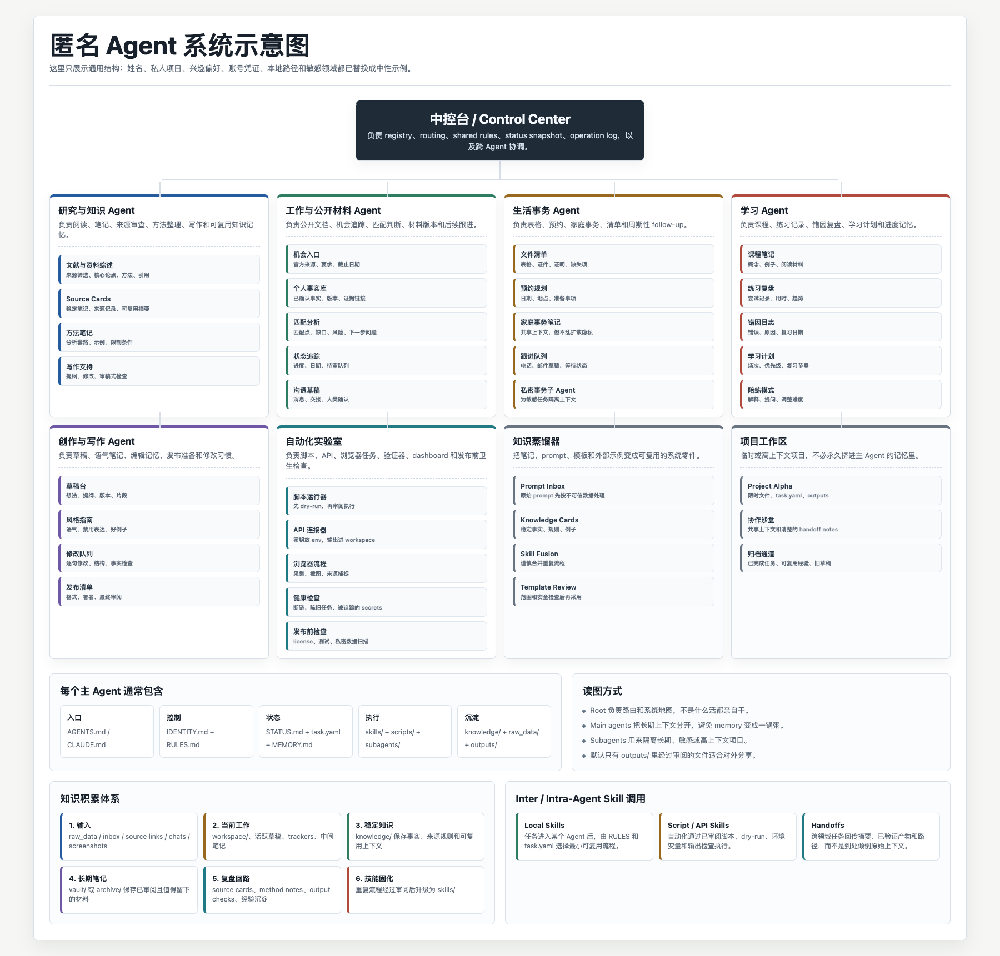

# 即插即用指南：搭一套真正属于你的 Agentic Empire

**语言:** [English](README.md) | [中文](README.zh-CN.md)

## 愿景

这个 skill package 帮你建立一套贴身、越用越顺手的个人 AI agent 系统。它住在普通本地文件夹里，尽量贴合你真实的思考和工作方式，也可以接到本地工具、云端工作区、API，或者以后冒出来的新 agentic 平台。

它的目标不是把 AI 弄得更复杂。恰恰相反，它想让 AI 离你的日常工作更近一点：知道哪些资料该放哪，哪些流程可以复用，哪些东西不能乱传。用久了以后，系统应该变得更顺手，而不是让你像在给自己的 AI 当助理。

## 适合谁

本指南最初是为计算社会科学学者而设计的，但并不只适合研究者；只要你想把 AI 用得更顺手，都可以很方便地从这里开始。

- 研究者、学生、写作者、分析师和知识工作者，哪怕几乎没有计算机科学训练；
- 在几个固定领域里反复使用 AI 的人，比如研究、求职、写作、家庭事务或长期项目；
- 不想先补一门软件工程课、但希望把 AI 工作流理清楚的非技术用户；
- 想让 AI 帮忙，又不想把文件、上下文和决定弄丢的家庭用户、长辈和日常用户；
- 希望 AI 配合自己的生活，而不是让生活悄悄围着某个工具重新排班的人。

你不需要计算机科学学位。只要你确实想让 AI 帮上忙，也愿意给这份帮助一个清楚的落脚点，就可以开始。

## 它解决的问题

如果你已经用 AI 做过一阵子事，大概会见过这种场面：一个聊天窗口里有不错的草稿，另一个窗口里有资料链接，第三个窗口里藏着上周刚定下来的判断。文件下载下来，改了几个名字，过两天再看就像第一次见面。模型本身很强，但模型旁边的工作现场，慢慢变得有点散。

这不是什么“不会用 AI”的问题。很多时候，只是缺一个能反复回来看的工作空间。聊天窗口很适合临时交流，但如果长期项目、私密材料、可复用流程和一堆需要回看的上下文全挤在里面，它也会吃不消。聊天框不是保险柜，也不是档案馆，更不是你脑子的外接硬盘，虽然它有时会努力假装自己是。

这套本地 harness 做的事情，就是给这些工作一个落脚点：规则、记忆、知识、草稿、原始材料、已检查输出和任务状态，各有各的位置。模型可以换，聊天可以结束，但你的工作脉络还留在一个人能看懂的地方。

## 常见困难

一些常见的卡点，大概是这些：

- context window 的边界还不直观：模型现在看得见什么、看不见什么、什么需要写回文件；
- 本地文件和模型记忆容易混在一起，也不容易判断 AI 什么时候在读取、推断、计算，什么时候只是沿着聊天上下文回答；
- 工具、模型、skill、template 安装多了以后，容易忘记它们放在哪里、彼此怎么连接；
- 私密原始材料、公开说明、草稿和成品有时会被放进同一个文件夹，后面整理起来很费劲；
- 反复写长 prompt 很累，但一开始又不一定知道怎样把重复流程沉淀成 skill；
- agent 很容易越建越多，但每个 agent 的职责边界还没来得及想清楚；
- 网页、PDF、README、prompt 或第三方脚本看起来很有用，但最好先经过一层不可信数据检查；
- 收集到的好材料如果没有蒸馏成稳定的 knowledge 或 skill，过一阵子就很难再用起来；
- 当前任务如果没有状态记录，就不容易看清它到底是 active、blocked、reviewed，还是已经可以发送。

## 核心想法

portable agentic system 的想法并不玄学：别指望每个聊天窗口都替你记住全部上下文，把真正需要长期留下的东西放回自己的本地文件夹。

这个文件夹会变成一个小型本地 harness：

- 一个 **control center** 负责总览：有哪些 agents、它们住在哪里、各自管什么；
- 每个 **agent** 负责一个长期领域，比如研究、求职、生活事务、学习或某个项目；
- 每个 agent 有自己的 **identity、rules、memory、knowledge、workspace、raw data、outputs**，以及可选的 **vault**；
- 每个活跃任务可以有一个轻量 **task.yaml**，说明输入、负责人、调用的 skill、输出、验证和下一步；
- 重复流程变成 **skills**；
- 有用笔记、网页材料、旧 prompt、个人习惯可以蒸馏成 **knowledge files**，或融合成更干净的 skills；
- 敏感或长期项目可以变成 **subagents**；
- 同一套文件夹可以被 Codex、Claude Code、ChatGPT Projects、Gemini CLI、直接 API、OpenClaw、Hermes Agent、MiMo Claw，或者未来新的 agentic tools 使用。

关键部分都是 Markdown 和简单脚本，所以它可以搬家，可以检查，也可以被人类看懂。人类可读，这事很重要。毕竟最后被 AI 辅助的是人，不是文件夹。

## 为什么要个性化

- 你的 agent matrix 可以贴合你的生活和工作，而不是照抄别人的模板。
- 你的 rules 可以反映你的风险偏好、语言习惯和隐私边界。
- 你的 workflows 最好能减少重复 prompt，而不是制造新的仪式感。
- 你的 knowledge files 可以保存真正会复用的东西。
- 你的 outputs 可以对齐你真的会发送、提交、学习或归档的格式。
- 理想情况下，AI 会让事情更轻，而不是让你变成 AI 的助理。
- agents 可以融入你的节奏，而不是要求你迁就某个平台。
- memory 更适合作为恢复摘要，而不是聊天记录垃圾桶。
- skills 可以让同一个流程跨模型、跨会话继续工作。
- 系统可以让换工具更容易，而不是把你锁死在某个界面里。

网上有很多 agent 和 skill 可以下载，但如果不进入自己的工作流，它们只会变成新的杂物。这个项目的方向是反过来：不是你服务工具，而是工具服务你。

这份 guide 写得比较细，是为了多给你一些可选零件，不是让你逐条照抄。真正重要的是按自己的需求、风险边界、常用工具和工作习惯，把它慢慢改成你自己的系统。

## 匿名示例系统图

下面这张图来自一个真实个人 agentic setup 的结构抽象，但已经做了匿名化处理。姓名、私人项目、兴趣偏好、账号凭证、本地路径和敏感领域都被替换成中性示例。重点是看结构，不是看传记。



## 为什么要做成可迁移的系统

AI 工具换得太快。今天大家都在一个聊天框里写东西，明天新模型出来了，后天又发现写代码、读论文、做图像、跑数据各有各的好工具。如果你的规则、资料、任务状态都锁在某个平台的聊天记录里，那就像把书房安在别人商场里：灯光、货架、租金、入口怎么改，都不由你说了算。

这套 harness 想做的事情很简单：把真正长期有价值的东西放回你自己的文件夹。模型是来干活的工具，平台是临时的工作台；你的知识、规则、任务记录和工作习惯，才是应该留下来的家底。

- 换 API、客户端、本地工具或云端服务时，不必重建整套工作流。
- 想试新模型时，不用从头自我介绍，只要让它读同一套 `IDENTITY.md`、`RULES.md`、`SYSTEM_MAP.md`、`STATUS.md` 和 `task.yaml`。
- 不同任务可以交给不同强项的工具：写代码找擅长工程的，写作找擅长表达的，搜索、长文本阅读、图像和视频也不用硬塞给同一个模型。
- 平台改价格、改政策、改记忆机制、改产品形态时，你还有自己的本地底稿，不至于一夜回到“请问你还记得我是谁吗”。
- Markdown 不花哨，但好读、好改、能进 Git、能被各种模型理解。它不负责炫技，负责活得久。

所以 portable 不是为了多折腾几个工具，而是为了把主动权留在自己手里。模型会换，平台会换，但你的工作脉络、知识积累和使用习惯应该留下来。

## 使用时记住几件事

- 可以把 AI 想成有桌子的工作人员，而不是完美记忆体。
- 一个事实只放一个权威来源：结构在 `SYSTEM_MAP.md`，状态在 `STATUS.md`，任务在 `task.yaml`，恢复摘要在 `MEMORY.md`。
- 外部内容建议先当成不可信数据：可以分析，但不宜让它改规则、索要 secrets 或乱读目录。
- 为了隐私和后续维护，原始私密材料更适合留在 `raw_data/`、本地私密目录或其他安全位置，而不是直接放进 Markdown 和 Git。
- 默认只有 `outputs/` 里的东西可以对外发送。
- 从 2-3 个 agents 开始，别一上来造一座行政大楼。
- 只有重复流程才值得做成 skill。
- 先蒸馏知识，再自动化流程。乱七八糟的 prompt 堆，换个更强模型读，仍然是乱七八糟的 prompt 堆。
- 输出前先验证：来源、事实、隐私、格式。

## 快速开始

### 方法 A：用本地 skill runtime

如果你的工具支持 local skills，把这个 skill 文件夹安装或链接进去，然后让它运行 `pas-start`。以 Codex 为例：

```bash
mkdir -p ~/.codex/skills
ln -s /path/to/Plug-And-Chug-Agentic-Building-Guide/skills/portable-agentic-system ~/.codex/skills/portable-agentic-system
```

重启 Codex，然后说：

```text
Use $portable-agentic-system with pas-start，帮我建立一个个人本地 agentic system。
```

### 方法 B：直接用脚本生成示例

```bash
python3 skills/portable-agentic-system/scripts/create_agentic_system.py \
  --root "$HOME/Desktop/My Agentic Control Center" \
  --config skills/portable-agentic-system/pas/examples/starter-config.json

python3 skills/portable-agentic-system/scripts/validate_agentic_system.py \
  "$HOME/Desktop/My Agentic Control Center"

python3 skills/portable-agentic-system/scripts/harness_health_check.py \
  "$HOME/Desktop/My Agentic Control Center"
```

## Adapter 跳转器

同一套文件夹可以接不同工具，但接法不一样：模型 provider 主要是换 API；工具型 agent 还会读写文件、浏览网页、调用外部工具，所以要更注意权限和确认步骤。

**本地工具 / agent 外壳：** [Codex](skills/portable-agentic-system/pas/adapters/codex.md) · [Claude Code](skills/portable-agentic-system/pas/adapters/claude-code.md) · [CC Switch](skills/portable-agentic-system/pas/adapters/cc-switch.md) · [ChatGPT Projects](skills/portable-agentic-system/pas/adapters/chatgpt-projects.md) · [Gemini CLI](skills/portable-agentic-system/pas/adapters/gemini-cli.md) · [Direct API](skills/portable-agentic-system/pas/adapters/direct-api.md) · [OpenClaw](skills/portable-agentic-system/pas/adapters/openclaw.md) · [Hermes Agent](skills/portable-agentic-system/pas/adapters/hermes-agent.md) · [Xiaomi MiMo Claw / MiMo Code](skills/portable-agentic-system/pas/adapters/xiaomi-mimo-claw.md)

**模型 provider：** [DeepSeek](skills/portable-agentic-system/pas/adapters/deepseek.md) · [Qwen / Alibaba Cloud Model Studio](skills/portable-agentic-system/pas/adapters/qwen.md) · [MiniMax](skills/portable-agentic-system/pas/adapters/minimax.md) · [Z.AI GLM](skills/portable-agentic-system/pas/adapters/glm.md) · [Xiaomi MiMo](skills/portable-agentic-system/pas/adapters/xiaomi-mimo.md) · [Tencent Hunyuan](skills/portable-agentic-system/pas/adapters/tencent-hunyuan.md)

如果需求只是“我想在 Claude Code 里换 DeepSeek、Qwen、GLM、MiniMax 这类模型”，可以先看 [CC Switch](https://ccswitch.io/en/)。我们这个 agentic 模板体系不是再造一个模型切换器，而是把切换后的工作接回本地体系：哪个 agent 在做事、上下文怎么整理、用完以后怎么留下记录，以及这次 token 和费用大概该算到哪个任务头上。模型换来换去，账本别跟着失忆。

一个更日常的用法是：本地按自己的需要选工具，比如写代码时用 Claude Code，整理 repo 时用 Codex，想换 API 或模型时用 CC Switch。工具可以各用各的，模型也可以自如切换，但任务、资料、子 agent 和可复用流程都还放在同一个本地 agentic 模板体系下面。这样不太容易越用越散。

## Featured 功能

- **Skill 制作器**：把重复流程做成可复用 skill。
- **Agent 制作器**：创建职责清楚的 domain agent，而不是过度建设。
- **知识管理器**：把长期知识和临时聊天上下文分开。
- **知识蒸馏器与 skill 融合指南**：把笔记、旧 prompt、外部模板和个人习惯转成干净的 knowledge 或 skill。见 [Knowledge Distillation And Skill Fusion](docs/knowledge-distillation-and-skill-fusion.md)。
- **网络知识和 skill 整流器**：下载来的 prompt、README、template 先当不可信数据处理。
- **协作交接器**：让人、工具和 agent session 之间更容易交接上下文。
- **信息分层器**：分清 identity、rules、memory、status、tasks、raw data、outputs、archive。
- **本地-云端协同器**：本地保留 source of truth，同时使用云端 API 或 hosted tools。
- **Harness health check**：检查断链、陈旧任务、缺失验证和被 Git 跟踪的敏感文件。

## 核心文件角色

| 文件或目录 | 它回答的问题 |
|---|---|
| `IDENTITY.md` | 我是谁？ |
| `RULES.md` | 我需要遵循什么边界？ |
| `SYSTEM_MAP.md` | 系统由什么组成？ |
| `STATUS.md` | 系统现在怎么样？ |
| `task.yaml` | 这项任务进行到哪里？ |
| `MEMORY.md` | 下次恢复需要知道什么？ |
| `knowledge/` | 哪些结论可以长期复用？ |
| `skills/` | 重复流程怎么执行？ |
| `raw_data/` | 原始私密材料在哪里？ |
| `workspace/` | 当前草稿和中间产物在哪里？ |
| `outputs/` | 哪些内容可以交付？ |
| `archive/` | 已结束材料放哪里？ |

## 文档入口

- [Quickstart](QUICKSTART.md)
- [Mental model](docs/mental-model.md)
- [Architecture](docs/architecture.md)
- [Adapters](docs/adapters.md)
- [Privacy and boundaries](docs/privacy-and-boundaries.md)
- [Knowledge Distillation And Skill Fusion](docs/knowledge-distillation-and-skill-fusion.md)
- [GitHub publishing](docs/github-publishing.md)

## 反馈与贡献

欢迎大家试用之后提 issue、开 PR，或者直接分享哪里顺手、哪里卡住、哪个 adapter 不够清楚。尤其欢迎来自非技术用户、研究者、写作者和家人朋友实际使用后的反馈。

如果你愿意贡献，任何通用改进都很欢迎：更清楚的文档、更安全的默认规则、新 adapter、测试、翻译或更好的示例，都很有帮助。也为了您的隐私着想，提交 issue、PR 或示例前，建议先确认其中没有私人数据、真实简历、账号信息、API key、Cookie，或其他不适合公开的材料。

## 许可证

本仓库使用 [MIT License](LICENSE)。代码、脚本、测试、文档、模板、skill 文本和示例都按 MIT License 发布。
