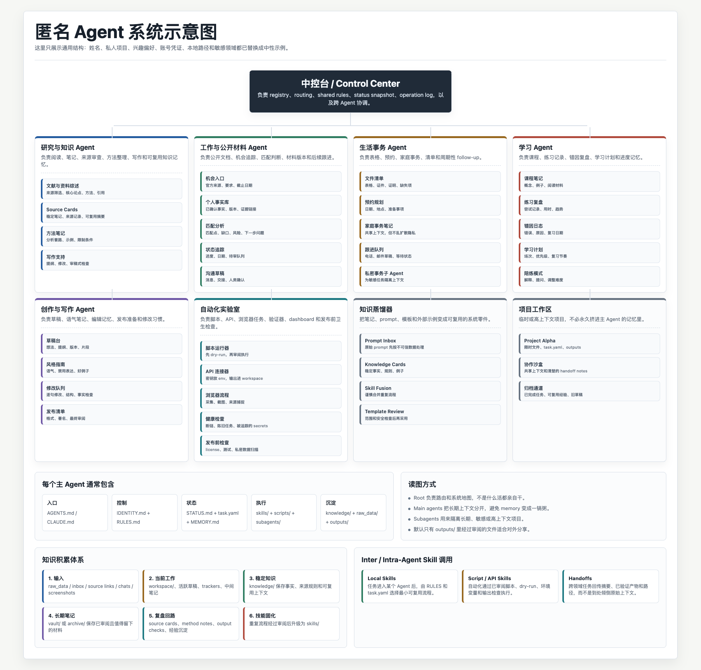

# Plug-And-Chug Agent Harness 搭建指南

[English](README.md) | [中文](README.zh-CN.md)

一套经过匿名化、local-first 的 Agent Harness 解释、设计、生成、适配和验证工具。

## 最重要的概念

模型是正在工作的那个模块，但模型不等于整个 Agent 系统。**Harness 是围绕执行配置好的全部架构**：runtime 入口、identity、rules、权限、Agent 所有权、skills、tools、connectors、任务、生成式状态、memory、knowledge、原始材料、workspace、artifacts、logs、outputs、hooks、gates、budgets、locks、worktrees、validators 和 adapters。

更换模型就像更换员工。公司的使命、规章、档案、部门手册、工单、工具、办公桌和质检流程仍然保留。单 Agent 中，模型就是员工；只有多 Agent 矩阵中负责协调的中控模型才叫经理。

### Harness 概念图


### Anonymised Example System Map



第一张图解释概念；第二张图展示一种可能的多 Agent 拓扑。两张图要同时保留：实例不等于所有人的系统，概念图也不假装覆盖全部实现细节。

## Memory、Knowledge 和当前上下文

- `MEMORY.md`：精简的交接班和恢复索引。
- `knowledge/`：长期档案馆、参考资料库和机构知识。
- `task.yaml` 与 `workspace/`：当前任务状态和实际执行桌面。
- `raw_data/`：具名原始材料，默认禁止递归全读。
- `outputs/`：经过审核的交付物，但不自动代表可以发送或发布。

## v2 解决了什么

- Codex、Claude Code、Gemini 使用各自真实入口，不再使用虚构的 `@import`。
- compatibility manifest 明确区分 native runtime、workspace projection、provisional product、switchboard、provider 和 direct API harness。
- task contract 加入 objective、authority、禁止动作、完成/失败条件、verification receipts、资源占用和 handoff。
- `STATUS.md` 从 task manifests 确定性生成，不再依赖模型“记得顺手更新”。
- Codex/Claude `Stop` 与 Gemini `AfterAgent` 有真实协议翻译层，不再只是调用同一个脚本的 adapter 壳子。
- closeout gate 会阻止缺少产物、验证回执、最新状态、释放任务锁、预算合规或 handoff 的假完成。
- instruction、memory、task 和大文件 manifest 都有硬预算。
- 并发 Agent 使用任务声明资源、writer/session/worktree 校验、心跳续租和 Git worktree 规则。
- Skill/subagent description 有正向、负向和碰撞测试。
- 实际运行的 `SKILL.md` 足够完整，但仍用 progressive disclosure 按需加载超长教材和单个 adapter。
- 同时提供 Harness 概念图与系统化匿名实例图。
- 30+ 页指南以基础原理、上下文与状态、架构、可靠性和建设工作簿为主体；adapter 只保留为紧凑附录。

## 安装 Skill

Codex 项目级安装：

```bash
mkdir -p .agents/skills
ln -s /path/to/Plug-And-Chug-Agentic-Building-Guide/skills/portable-agentic-system \
  .agents/skills/portable-agentic-system
```

Codex 个人级安装：

```bash
mkdir -p "$HOME/.agents/skills"
ln -s /path/to/Plug-And-Chug-Agentic-Building-Guide/skills/portable-agentic-system \
  "$HOME/.agents/skills/portable-agentic-system"
```

Claude Code 使用 `.claude/skills/`；Gemini CLI 使用 `.gemini/skills/` 或 `.agents/skills/`。安装前请先阅读相应 adapter，因为不同 runtime 的发现、加载和强制机制并不相同。

## 生成起步系统

```bash
python3 skills/portable-agentic-system/scripts/create_agentic_system.py \
  --root "/path/to/My Agent Harness" \
  --config skills/portable-agentic-system/pas/examples/starter-config.json

python3 skills/portable-agentic-system/scripts/validate_agentic_system.py "/path/to/My Agent Harness"
python3 skills/portable-agentic-system/scripts/check_budgets.py "/path/to/My Agent Harness"
python3 skills/portable-agentic-system/scripts/generate_status.py "/path/to/My Agent Harness" --check
python3 skills/portable-agentic-system/scripts/harness_health_check.py "/path/to/My Agent Harness"
```

generator 默认拒绝覆盖已有文件。只有在检查精确目标后才应使用 `--force`。

## 产品分类

| 类别 | 产品 | 正确理解 |
|---|---|---|
| Native runtimes | Codex、Claude Code、Gemini CLI、OpenClaw、Hermes Agent、MiMo Code | 有各自真实入口、skills、hooks 或 workspace 语义 |
| Workspace/manual projections | Claude Cowork、ChatGPT Projects、Custom GPTs、generic workspace agent | 通过 project/folder/upload instructions 投影，不冒充本地原生入口 |
| Provisional | Xiaomi MiMo Claw、Tencent WorkBuddy | 产品存在，但原生加载和门禁语义尚未证实 |
| Switchboard | CC Switch | 负责 provider/model/config/routing，不负责长期 Harness 状态 |
| Providers | DeepSeek、Qwen、MiniMax、GLM、MiMo API、Tencent Hunyuan | 提供模型推理，不能自己读取本地 Agent 文件 |
| Custom harness | Direct API application | 应用作者负责上下文、tools、持久化、预算、门禁和 writeback |

详见 [兼容性清单](skills/portable-agentic-system/pas/compatibility/runtime-compatibility.json) 和 [adapter 指南](docs/adapters.md)。静态检查、fresh-session 加载、完成门禁、并发验证和外部交付是不同证据层级。

只有 Codex、Claude Code、Gemini CLI 会生成原生入口和完成 hook 翻译层。OpenClaw、Hermes Agent、MiMo Code 目前只是有官方文档依据的 runtime 指南，没有生成集成；direct API 只是 reference pattern。这样不会把一份 Markdown adapter 壳子误认为已经可运行的支持。

## 主要文件

- [Quick Start](QUICKSTART.md)
- [可单独投喂的完整建设 Playbook](skills/portable-agentic-system/pas/references/master-build-playbook.md)
- [给朋友的简单 Prompt](skills/portable-agentic-system/pas/references/friend-starter-prompt.md)
- [分阶段问卷](skills/portable-agentic-system/pas/references/intake-questions.md)
- [Filesystem Contract](skills/portable-agentic-system/pas/references/filesystem-contract.md)
- [Task、Gate、Budget 和 Lock](docs/governance.md)
- [Runtime/Provider Adapters](docs/adapters.md)
- [长篇指南](docs/agentic-systems-field-guide.md)
- [Harness 概念图](docs/assets/harness-concept-map.zh-CN.svg)
- [匿名化系统实例图](docs/assets/anonymised-agent-system-map.zh-CN.svg)
- [DOCX 下载](docs/downloads/Agentic-System-Building-Guide.docx)
- [PDF 下载](docs/downloads/Agentic-System-Building-Guide.pdf)

## 验证声明

```bash
python3 -m unittest discover -s tests -v
python3 /path/to/skill-creator/scripts/quick_validate.py skills/portable-agentic-system
git diff --check
```

health score 明确只是 static evidence。它不能证明 runtime 已加载入口、hook 阻止了假完成、provider 已响应、文件已送达或系统已部署。

公共版本只使用匿名化的一级、二级目录模式，不包含个人路径、凭据、账户资料、客户/学生信息、原始私有数据、日志或具体报告内容。
