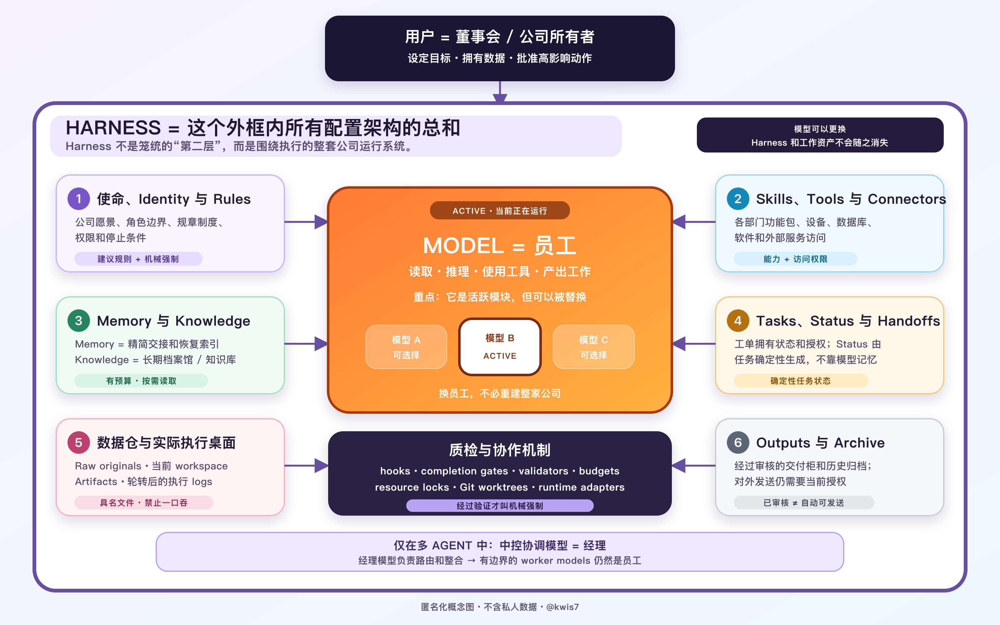

<!-- GENERATED by scripts/build_master_playbook.py. Edit docs/handbook chapters. -->

# 理解 AI Agent，搭建自己的工作系统

已经有 Codex、Claude Code、WorkBuddy 这些好用的应用，为什么还需要自己的本地 Agent 系统？

@kwis7 | Reader edition 4 | 2026-10-03

# 搭建一个下次还能接着用的 AI 工作空间

做研究、写文章或准备一份材料，常常要和 AI 来回讨论几次。第一次谈背景，第二次改草稿，过几天又补了资料。每次对话都有用，可一旦停下来，再继续时就得翻聊天记录：上次采用了哪份资料，为什么改掉那一段，还有什么没有做完？

这份教程从这样的工作出发。我们想保存的，不只是某次回答，还有让回答成立的依据，以及以后继续工作时用得上的线索。把这些内容放在自己能查看、能修改的文件里，下次就有东西可供助手读取，不必全靠你重新交代。

本指南最初是为计算社会科学学者而设计的，也适合学生、写作者和日常使用 AI 的人。没有编程基础并不妨碍开始。书里会解释为什么要这样安排，也会带你用现有的 AI 软件做一次；读到不熟悉的概念时，可以拿自己的任务来问，而不必先把所有术语记住。

## 从你自己的 AI 助手开始

先打开[新手指南](start-here.zh-CN.md)，把起步提示词交给平时使用的 AI 应用。提示词里已经带有仓库链接。助手会先了解你想做什么、使用什么软件和电脑，再提出一个起步方案。文件准备放在哪里、哪些现有内容要保留，都先让你看清楚，确认后再动手。

可以把第一次尝试放得很小：建一个合适的本地工作空间，完成一份结果并核对，再写下文件在哪里、下次从哪一步继续。随后开一个新会话，照着“下次使用卡”试一次。如果新会话找不到文件，或没有接上进度，这正是需要调整的地方。

也因此，画好了设计、创建了目录、完成了任务、在新会话中继续，各自只能说明相应的一步。助手不能因为文件夹已经建好，就说整套安排都验证过了。

终端命令放在最后的工具参考章和[快速开始](../QUICKSTART.zh-CN.md)中，供想直接操作的人使用。跟着助手走引导路线时，可以先把注意力放在任务和结果上。

<a id="模型可以更换工作可以保留"></a>
## 把长期工作留在自己手里

换一个模型，不必把已有的文献笔记、工作要求和项目记录都丢掉。它们原本就是你的工作，可以用普通文件保存在你掌握的位置。新的应用能否读到这些文件、怎样使用工具，则要另行确认。保留了底稿，至少不必重新积累资料；这并不等于所有工具都能直接接手。

书里把围绕模型配置的工作环境称为 **Harness**。它包含指令、文件、工具、任务状态和检查。有些安排写在文档中，例如工作要求；有些依靠软件实现，例如工具访问权限。后文会用具体任务说明两者的差别。

公司图可以帮助我们区分这些职责。模型负责当前的理解和推理，你决定工作目标，也掌握自己的材料。图中的“员工”“所有者”是比喻，不能据此假定模型有人一样的忠诚、意识，或已经拥有读取所有文件的权限。

怎样判断这些安排值不值得保留？可以看下一次继续工作时，它们有没有帮你找回依据和进度。如果多出许多文件，却仍然说不清当前版本在哪里，就先解决这个问题，不必急着增加更多角色或目录。

<a id="借一个例子学做法再用到自己的工作中"></a>
## 用虚构练习理解这些安排

第 1 至 4 章以三个虚构场地的比较贯穿讲解。资料已经备好，不需要拿个人信息来试。你会看到同一项工作怎样从比较草稿走到检查过的结果，又怎样留下一份能供新会话使用的交接记录。

这项练习是可选的。也可以直接使用引导搭建时选定的任务，借用相同的做法。搭个人系统，并不要求先建一个“场地比较 Agent”。

第 5 至 8 章再讨论工作增长后可能遇到的问题：什么时候分开职责，怎样换工具，如何检查完成情况，以及哪些旧安排需要整理。最后一章把这些方法接到标准工具包。教学工作空间可以很小，标准生成器提供的结构则更完整；较小的教学安排不是生成器里某个未写明的选项。

<a id="让结论与证据对应"></a>
## 读教程时，分清演示与实际结果

练习资料是合成数据，书中的操作说明也不等于已经在你的电脑上执行过。看到一个命令或兼容性记录，可以了解仓库实现了什么；要知道当前应用有没有加载规则、保存文件或恢复任务，还得亲自试过并留下对应记录。保存文件与对外发送，也要分别确认。

接下来读 [Agent 到底怎样工作](handbook/zh-CN/00-foundations.md)。先弄清一次任务里谁在推理、谁在读文件、哪些信息真的进入了上下文，再看后面的场地练习，就容易理解每一步为什么这样做。

# 开始之前：Agent 到底怎样工作

请 AI 比较三份资料，它可能先读文件，再列出差异，发现信息不足时继续查证，最后保存结果。看起来都是同一个助手在做，但这些动作并不全由模型完成。模型作出判断，文件工具负责读取，运行环境把内容交给模型，也决定哪些操作可以执行。

弄清这层分工很有用。例如，答案里说“我读过资料”，你就知道还要看它有没有真的调用读取工具；电脑里放着一份规则，也不能据此认定模型已经看到了它。本书所说的 **Agent**，就是把模型、指令、工作状态、工具和执行循环组合起来，承担一项职责的系统。具体做法可以不同：它可以只在一次会话中运行，不一定使用本地文件，也不要求有其他 Agent 配合。

<a id="把图看作一家正在工作的公司"></a>
## 借公司图辨认各部分职责

图里画出了本仓库考虑的完整安排。第一次尝试时，可以只看与手头任务有关的部分，不必先把每个方框都建出来。



先看最上方的你。目标怎么定、哪些材料可以交给系统、重要动作是否获准，最终由你掌握。模型负责理解当前收到的材料并推理，可能给出回答，也可能提出工具调用。图中把它比作员工，是为了说明这份职责；资料存在哪里、工具有没有权限，不是靠模型自己说了算。

再看 Agent。比较来源的研究助手就是一种职责：有任务说明，知道允许使用哪些材料，保留当前进度，并通过工具完成相应操作。同一个模型可以在不同会话里承担不同职责，各自使用不同的上下文和权限；一种职责也可以先后交给不同模型。取名叫“研究 Agent”，并不会因此训练出一个新模型。

周围的 **Harness** 是支撑这项工作的配置，包括规则、文件、方法、工具、状态和检查。图中把它们和当前模型放在同一个系统边界里。换模型时，文件和方法可以保留；若连运行环境也换了，就要再看新软件怎样读取说明、调用工具，原来的适配和验证是否还适用。

公司比喻也有方便理解的地方：Skill 可以比作操作手册，知识像参考资料，简短记忆像交接说明。若有多个角色需要协调，再安排一个模型负责路由和整合，也就是图里的经理。它不是每个系统都要有的层级，更不会因为叫“经理”就获得额外授权。

不要把比喻当成模型具备意识、忠诚或永久记忆的证据。图里画着质量控制，也不表示文字规则已经能拦下违规操作。具体检查是否生效，要看相应软件有没有实现、是否实际验证过。

<a id="先分清几个基本概念"></a>
## 同一款软件，可能承担几种作用

在一次文件比较中，模型负责判断，工具负责读取或保存，运行环境负责把任务和返回结果送到合适的位置。你使用的应用可能把这些功能都包在一个界面里，因此这些名称不一定对应不同产品。下面的表可以用来查词，不必一次记完。

| 概念 | 在系统中承担什么作用 |
|---|---|
| 模型（model） | 理解收到的上下文，生成回答或提出动作 |
| Agent | 通过指令、状态、工具和执行循环承担一项职责 |
| 提示词（prompt） | 向模型传达请求、指令或其他材料 |
| 技能（Skill） | 打包可复用的流程与配套资源 |
| 工具（tool） | 完成读文件、执行计算等具体操作 |
| 运行环境（runtime） | 承载执行、提供上下文、调用工具并处理返回结果 |
| Harness | 配置模型执行所需的工作环境 |
| 文件（file） | 保存能够跨会话留存的信息 |
| 上下文（context） | 模型在生成当前回复时实际获得的材料 |

还可以从下一步由谁决定来区分两种做法。固定工作流按预先设定的顺序走；Agent 的执行循环允许模型根据观察结果，在系统限制内决定后续步骤。实际使用时，两者可以结合。这一区分参考了 [Anthropic 对工作流与 Agent 的解释](https://www.anthropic.com/engineering/building-effective-agents)，并不据此认证某个具体产品的实现。

## 提示词交代任务，Skill 提供方法

拿场地练习来说，“根据给定笔记，比较适合 16 人在 18:00 之后使用、且必须有无台阶入口的场地”是在交代这一次的任务。“来源没有写明的事实保持未知”，则可能是一类比较任务都要遵循的要求。两种文字被加载以后，都能影响回答，但适用范围与保留时间不同。

模型收到的内容也不只是你刚发的消息。运行环境还可能把相关项目说明、已加载的 Skill 和工具返回的结果放进上下文。所以，看见一条回答时，最好同时知道这次给过它哪些材料。

本仓库用 `SKILL.md` 保存可复用指令。里面可以写一套比较方法，附上示例、参考资料或脚本。以后再做同类工作，支持它的软件可以找到并加载这份说明，不必每次重新写整个过程。

这也就是把方法“置顶”（pin）的意思：放到容易发现、能够重复使用的位置，不是永久激活。[Agent Skills 规范](https://agentskills.io/specification)让软件先通过名称和描述发现技能，需要时再加载完整说明。实际能否发现和加载，要看所用软件是否支持；它不会因为文件叫 `SKILL.md` 就自动成为更高优先级的系统消息，也不表示每轮都加载全文。

加载的文字提供方法和判断依据，不会训练新的神经能力或修改模型权重，也不会授予工具权限。Skill 附带脚本时，仍要通过实际执行工具，按访问规则调用。文档里写了“发送邮件”，也不等于已经连接账户或获得发送授权。

因此，收到任务条件、来源笔记和逐项比较方法，模型就有更具体的依据可用。只说“帮我选一个场地”，它未必知道怎样处理缺失信息。上下文写清楚有助于工作，但生成的结果仍要检查。

<a id="沿着一次执行过程看清分工"></a>
## 比较三份资料时，实际发生了什么

这次练习用的是合成笔记，我们只比较，不预订。请求进入运行环境后，模型先判断要检查什么。如果笔记还不在上下文里，它可以提出读取文件的请求。请求里要有操作名称和参数，光在回答中写一句“已经读过”，不能说明读取真的发生了。

执行请求的是运行环境。它按实际访问策略调用获准的工具，可能返回文件内容，也可能拒绝访问、报告路径错误。返回结果进入后续上下文以后，模型才有相应资料可供比较；资料还不够时，也可以继续请求允许使用的证据。

读到三份笔记后，Cedar Hall 支持已记录的条件，Willow Room 的时间不适合晚间活动，Maple Studio 没写无台阶入口的情况。最后这一项只能留下未知：推理不能补出资料里没有的入口说明。可以把下一步定为起草一条尚未发送的询问，但写出了问题，还没有获得答案。

草稿先放在 `workspace/comparison.md`。对照来源复核并修正后，再将检查过的版本保存到 `outputs/comparison.md`，把实际进展写入 `workspace/handoff.md`。结束时说明已完成什么、还缺什么；资料或授权不足，也可能在这里暂停。

整个过程都可能遇到问题。路径不对、工具不可用、权限被拒绝、返回内容不完整，或模型理解错了，都会影响结果。文件写入成功只能证明保存这一步，并不说明内容正确。只有聊天界面时，可以由模型返回文字、你来保存，但不能说已经自动写回。第 1 章会带你亲自做一次，观察这些步骤。

## Markdown 文件到底做了什么

`.md` 是 Markdown 常用的文件扩展名。它是可编辑的纯文本格式，例如用 `#` 写标题，用短横线写列表，用链接指向其他文件。即使不用专门软件，也能直接读里面的文字，适合保存需要检查和修改的指令、笔记或交接。

文件名的作用，要结合软件的约定看。`AGENTS.md` 或 `SKILL.md` 在预期位置被发现并加载，才可能成为项目指令或技能入口；它们不是放到任何地方都能执行的文件。`RULES.md`、`workspace/handoff.md` 等名称则说明项目内约定的用途，工作流程仍要安排读取。

下面的片段帮助区分这些用途，不是首次练习必须再创建的一套文件，也不是可以直接安装的完整 Skill：

```text
task-brief.md
比较适合 16 人在 18:00 之后使用的给定场地。
必须有无台阶入口。

RULES.md（示意的项目规则）
来源缺失的事实保持未知，不要编造。

skills/source-comparison/SKILL.md（示意流程）
依据每份来源逐项检查要求，并注明证据。

workspace/handoff.md（仅在实际发生后记录的示例状态）
草稿已保存到 workspace/comparison.md；尚待来源复核。
```

草稿保存后，它仍然是一份文件。下一次会话要用到其中的进展，就要把相关内容重新读进上下文。这与模型权重不同：权重是模型训练得到的参数，保存或读取文档本身不会更新这些参数。因而这里要分开看已保存的文字、本轮实际收到的材料，以及模型训练获得的能力；跨会话恢复靠的是找回记录，不是把每条笔记都写进模型内部。

<a id="通过明确反馈让系统适合自己"></a>
## 怎样把你的反馈留给以后的工作

先从明确要求开始。比如你说：“以后的来源比较，先给简短建议，再解释依据与未知项。”这就说清了你希望以后怎样做，以及它用于哪一类任务。如果你授权保留，可以留给比较工作使用，而不必自动套到诗歌、调试日志或所有未来对话里。保存的是你提出的要求，不是从中猜出某种人格。

同一次工作里的其他内容，存法也不同。“Maple 的入口仍然未知”是当前任务状态；反复有效的提取、比较、引用和复核过程，可以写成 Skill；为什么未说明不等于否定答案，则可以留作知识笔记。若全塞进一个记忆文件，以后改一项偏好，就容易连任务进度和方法也弄混。

你还可以明确选择解释用什么语言、写多详细、怎样复核、最后交付什么格式。用一段时间后再看这些要求是否仍适合自己，必要时修改。单次说“短一点”未必是在规定以后的所有回答，多次重复也只能提示一种候选，不能代替保留授权。

这里改变的是给模型的信息和做法，不是在自动训练它。普通纠正也不能用来推断敏感特征；留下的材料要适当、获准，并且能够复查。偏好有了范围，旧要求也能修订，才容易与当前任务相处。

## 已经有 AI 软件，为什么还要搭建自己的系统

Codex、Claude Code 或 WorkBuddy 等软件已经提供了不少工作能力。使用这本手册时，先看所选产品已有的运行环境、工具、指令加载和存储能否满足需求；不必为了“自己的系统”再写一套调度引擎或定制应用，也不假定这些产品没有记忆、Skill 或工作空间。有人直接使用内置安排，就已经足够。

需要自己整理的，通常是与这份工作有关的东西：哪些资料获准使用，什么要求要长期保留，这次做到哪里，有什么方法以后还会用。软件提供能力，具体怎样组织这些内容，可以按你的工作来选择。

这里说“本地”，是希望长期资料保存在你能掌握的位置，方便查看、备份，在合适的情况下做版本管理。这样来源还连着结论，新会话有线索可读，其他兼容工具也有机会使用同一份获准材料。但换工具后仍要检查它怎样加载说明、保存结果，并非把文件搬过去就算接入成功。

本地文件也不表示模型在本地运行。使用托管模型或连接器时，内容可能被发送出去。隐私要看实际数据流、访问权限、服务设置，以及交给系统的材料，不能靠 `.md` 后缀或目录名字保证。

整理这些内容也有成本：指令可能过期，副本可能不同步，旧方法可能不再适用。一次性的解释，普通聊天也许已经够用。反复出现、跨越会话或需要追溯依据的工作，才更值得试这套安排。接下来读[首次任务章节](handbook/zh-CN/01-first-task.md)，先做一件小事，再判断哪些东西确实值得留下。

# 1. 先完成一项小任务

第一次尝试，不妨选一项资料已经齐备、结果容易核对的工作。这样出错时，比较容易判断是资料缺了、模型理解错了，还是文件没有保存好。本章用一项可选的虚构练习说明这个过程。如果你已经在[新手指南](start-here.zh-CN.md)中选好了自己的任务，也可以把同样的做法用在那里。

假设你要准备一场 16 人参加的工作坊，场地必须能在 18:00 之后使用，而且所有人都要能从无台阶入口进入。联系场地之前，先请 AI 根据现有笔记做一份比较，看看哪些选项值得继续询问。

[首次项目练习](../examples/first-project/README.zh-CN.md)提供了三份来源笔记。场地和资料都是虚构的，并非真实商家的实时信息。我们只比较这些资料，不预订，也不发消息或付款；后几种动作没有包含在这项练习的授权里。

## 先看什么样的结果有用

“推荐 Cedar Hall”是一项结论，但还不够让人放心采用。你还得知道它为什么被选中，其他场地是哪里不合适。把同一套条件放到每个选项上检查，才能看出判断有没有依据。

| 场地 | 容量 | 记载的开放时间 | 无台阶入口 | 判断 |
|---|---|---|---|---|
| Cedar Hall | 18 人 | 18:00-21:00 | 有 | 满足已记录的条件 |
| Willow Room | 24 人 | 09:00-17:00 | 有 | 不满足晚间使用要求 |
| Maple Studio | 20 人 | 18:00-22:00 | 未说明 | 无法确认无障碍条件 |

三处的容量都够，但 Willow Room 的记载时间到 17:00 为止，不适合这次晚间活动。Cedar Hall 同时满足笔记里的时间和入口要求，可以列为候选。Maple Studio 的时间合适，入口情况却没有写明，暂时无法判断。

这里尤其要分清“未说明”与“没有”。Maple 的笔记没提无台阶入口，不能据此说它没有，也不能为了给出一个完整排名而猜它有。Cedar 通过了这几项比较，也不表示某个具体日期一定有空位：活动时长、价格和预订条款仍未确定。

## 使用你已有的工具

如果正在使用的 AI 工具能够读写本地文件，先确认它可以读取练习资料，并且只在你选定的工作副本里写入。为了保留仓库里的参考文件，可以先把练习复制到自己的本地目录，告诉助手哪一份允许修改。

只有聊天界面也能练习。把三份笔记明确贴上或上传，让模型返回 Markdown，再由你保存。这样能检查比较方法，但不能把本地文件加载和自动写回记为已经测试。模型或 API 的正常使用可能产生费用；练习不需要另买付费数据。

从自己的练习目录出发，可以这样交代：

```text
请读取 task-brief.md、sources/cedar.md、sources/willow.md
和 sources/maple.md。暂不读取 expected/。
只依据这些给定资料，比较适合 16 人在 18:00 之后使用、
且必须有无台阶入口的虚构场地。
将来源链接、判断和未知项写入 workspace/comparison.md。
输入缺失时明确指出，不要猜测。
不要联网、联系或预订。覆盖已有结果前，先商定具体改动。
```

给出请求以后，先检查助手是否真的读到了笔记，再看它生成的草稿。如果文件由你手动保存，就说明这一点。仓库里的 `expected/comparison.md` 和 `expected/handoff.md` 是编写的参考答案，不是你的运行结果；先尝试起草，再打开它们核对。

<a id="接受结果之前沿着来源检查"></a>
## 怎样核对这份比较

打开自己得到的 `workspace/comparison.md`，沿链接查看 `sources/` 下的三份笔记。先核对容量和时间是否抄对，再看它有没有把条件用错。三个场地都容得下 16 人，两个有晚间开放时间，但只有 Cedar 的笔记同时说明了晚间时间和无台阶入口。检查过这些，再与 `expected/comparison.md` 对照。

如果答案说 Maple 也符合要求，可以问：“哪份资料说明了它的入口情况？”找不到依据，就把这一项改为未知，并相应调整判断。留下这次纠正，之后查看比较时才能知道为什么改过；文字写得流畅，不能替代缺失的事实。

核对并修正后，再请助手把检查过的版本保存到 `outputs/comparison.md`，同时保留原草稿。接着写 `workspace/handoff.md`：这次实际检查了什么，还有哪些未知，哪些路径允许读写，以及下一步可以做什么。这里的下一步可以是起草一条询问 Maple 入口的问题，先不发送。

交接写好了，还要等新会话实际接手后，才能说恢复测试通过；此前记为未测试。若以后要做真实预订，也需要补充新信息，并另行取得相应授权。

# 2. 给工作一个可以继续的位置

上章得到了一份比较。假如过了一周，你想继续联系场地，只看到“Cedar 是候选项”这句话还不够：当时用了哪些条件，入口信息从哪来，价格有没有查过？这些问题没有记录下来，新会话可能又从头调查，也可能把一个有限的结论用到不适合的地方。

工作空间就是用来保存这些线索的。这个例子只需要一个小目录，把给定笔记、工作结果和交接分开放。仓库里的 `expected/` 留作教学参考。先把这一项工作放清楚，用不着为了它另建 Agent 或数据库，也不必立刻生成完整项目骨架。

<a id="让每个文件有明确用途"></a>
## 为什么草稿、结果和交接要分开

`workspace/comparison.md` 保存正在修改的草稿。对照来源检查以后，再把确认过的版本放到 `outputs/comparison.md`。以后找当前结果，就看后者；原草稿留着，方便了解修改过程，不把它当成另一个同样有效的最终答案。

`workspace/handoff.md` 则回答“现在做到哪里、下一步可以做什么”。如果后来改了决定，先核对依据，更新结果，再同步修改交接。否则，结果已经变了，交接却仍指向旧结论，新会话就可能接错。

来源笔记要另外保留，因为它记录的是别人提供了什么，不是我们最终选了什么。随着工作增加，还会遇到几种不同用途的信息：

| 信息类型 | 回答的问题 | 例子 |
|---|---|---|
| 来源资料 | 提供了什么证据？ | Cedar Hall 记载的开放时间 |
| 任务状态（task state） | 现在做到哪里？ | 比较已检查，尚未联系场地 |
| 记忆（memory） | 哪条简短线索有助于恢复工作？ | 当前任务位置与关键决定 |
| 知识（knowledge） | 哪种稳定认识值得复用？ | 证据缺失如何影响比较判断 |
| 技能（skill） | 哪种做法应该重复使用？ | 逐一检查候选项是否满足每项要求 |

例如，“Maple 的入口还不知道”属于这项任务；“怎样处理来源未说明的信息”可以成为以后用得上的知识；逐项提取、比较和复核的方法，则可能写成 Skill。分开以后，更新一项任务时，不必连长期方法一起改。

还有一个容易混淆的词是 **上下文（context）**。它指模型在当前会话中实际收到的材料，并不是电脑里所有文件的总和。你说“请读取来源”，只是在提出请求。先核对工具实际返回的读取结果，再看答案用了哪个文件、哪条事实；若无法观察读取过程，就不要把本地加载记为已验证。

<a id="保留来源也保留未知"></a>
## 来源写了什么，就保留什么

Maple 的笔记写着入口情况未说明，就把这点保留在输入中，在结果里解释它对选择有什么影响。不要为方便比较，直接把来源改成“有入口”或“无入口”。如果以后拿到了新证据，另记它的出处和日期，再更新受影响的判断。这样回头查看时，才知道结论为什么变了。

真实工作也是同样的道理。摘要可以帮助理解来源，但读者仍要能分辨哪些是资料里的说法，哪些是你的推断。保留足够的出处，让别人可以沿着这条关系复核；不必为了保存依据，把整段聊天都留下来。保存和交给工具的材料，都要在你获准使用的范围内。

<a id="有需要时再增加结构"></a>
## 什么时候才需要更多目录

较大的项目会用到更多约定位置。`raw_data/` 放任务获准读取的输入，`workspace/` 放草稿，`artifacts/` 放生成的中间产物，`logs/` 记录执行轨迹，`outputs/` 放检查过的结果，`archive/` 放已经结束的材料。详细分工见[文件系统契约](../skills/portable-agentic-system/pas/references/filesystem-contract.md)。个人信息原件仍由你保管，只把当前任务所需的最少字段或明确授权的脱敏衍生资料交给 AI。

目录名并不能限制工具。文件夹叫 `private`，如果工具拥有整个目录的读取权限，照样可能读到里面的内容。涉及敏感资料时，要看实际访问限制，也要确认哪些内容会进入模型。公开示例使用合成资料或获准公开的内容，不能仅仅把私人记录换个名字就当成脱敏。

增加目录之前，可以先试着找三样东西：当前答案、它的来源、下一步。如果一分钟左右就能找到，现有安排也许已经够用。找不到时，看看具体是文件名含糊、版本难分，还是没有留下进度，再解决那个问题。目录多少并不能说明工作空间好不好，关键是继续这项工作时能不能顺利找回所需内容。

# 3. 换一个会话，继续刚才的工作

今天的比较做完了，你关掉对话，过几天再来。新会话面对的是保存下来的文件，未必能看到当时的讨论。它该从哪里开始？哪些结论已经检查过，哪些问题还没有答案？

这些信息需要留在工作空间里。以场地练习为例，Cedar 可以进入候选名单，Maple 的入口情况仍待确认，比较并不等于预订已经办妥。如果交接时只写“场地任务完成”，下次就很容易从错误的前提继续。测试能否续做，就是检查留下的记录是否足以让新会话正确完成下一步。

## 留下能指向下一步的交接记录

先把自己放在下次打开文件时的位置：你需要知道原来想解决什么问题、结果存在哪里、结论依据哪些资料，以及接下来还缺什么。聊天里每次改句子、尝试格式的过程通常不必带过去。保留会影响下一步的决定和文件位置，就能写出一份简短而有用的交接记录。例如：

```text
任务：比较三个虚构场地，要求容纳 16 人、可在 18:00 之后使用，
并有无台阶入口。
结果：outputs/comparison.md。草稿：workspace/comparison.md。
来源：sources/cedar.md、
sources/willow.md、sources/maple.md。
已检查：容量、开放时间，以及来源中的入口说明。
判断：Cedar 满足已记录条件；Willow 的时间不合适；
Maple 的入口情况仍然未知。
限制：仅使用合成笔记。空位、价格、准确活动时长尚未核实。
未获得联系或预订授权。
下一步：确认复核结果存在，再起草一条询问 Maple 无台阶入口的
问题，保存到 workspace/maple-question.md，但不要发送。
只读本交接记录、task-brief.md、复核结果和三份具名来源；
只写这条问题与本交接记录。
恢复测试：观察新会话实际接手前，保持未测试。
```

这段记录说明了为什么选择 Cedar，也说明了为什么下一步只能起草问题。新会话可以沿着文件路径重新检查依据，不必从整段聊天里猜测最后采用了哪个版本。[`expected/handoff.md`](../examples/first-project/expected/handoff.md) 是对照用的参考。写自己的交接时，只记录这一轮确实完成的检查，不能把参考答案中的检查当成自己已经做过的事。

## 做一次重新接手练习

在练习副本中打开新会话，让它先读 `workspace/handoff.md`；如果所用界面不能自行找到文件，就明确提供交接记录和其中列出的获准来源。请它说明当前结论和未解决的问题，再按记录起草询问 Maple 无台阶入口的问题，保存到 `workspace/maple-question.md`，更新交接记录。这个练习不联网、不联系场地，也不预订。

接着查看它实际做了什么。它应当找到复核后的结果，知道 Cedar 为什么进入候选名单、Willow 为什么被排除，并让 Maple 的入口继续保持未知。重新打开保存的问题和更新后的交接记录，记下所用工具、测试日期和实际结果。问题写出来了，入口情况仍然没有得到确认；如果某份指定资料找不到，也应把缺口写出来，不能凭记忆补回。

还可以另开一个会话，练习资料缺失时怎么继续。按照教程中的缺失来源提示，只允许读取 `task-brief.md`、`sources/cedar.md` 和 `sources/willow.md`，说明 Maple 笔记这次不可用。无需删除原件；本轮也不得读取其他练习文件，或采用记忆中的场地事实。把这次有限的比较另存到 `workspace/missing-source-check.md`，将 Maple 标为未评估，保留原来的复核结果。这样能看出模型是否遵守本轮输入范围，但若要证明它确实无法访问其他文件，还要检查工具权限。提示词本身做不到这种隔离。

## 重试之前，先确认留下了什么

中断以后不必立刻从头再来。先查看草稿、复核结果和 `workspace/handoff.md`，找出最后完成的那一步。例如，草稿已经保存，但还没有复核后的结果，就应从复核继续；不能因为草稿看起来完整，就把它当成检查过的输出。

重新读一次资料、重写一份可替换的草稿，通常不会改变外部状态。预订、发送消息和付款则不同：重复操作可能带来重复预订、重复消息或重复付款。遇到超时，先查外部服务的记录。没有收到响应，只能说明结果还不明确，不能据此认定操作没有发生，更不能直接重做。外部动作还需要相应授权。这次虚构练习没有外部操作，但交接中保留动作状态的习惯，到了真实工作里会很有用。

任务变多以后，可以用工具包的 `tasks/<task-id>/task.yaml` 记录状态，再从它生成 `STATUS.md`。其中有更完整的范围、验证和生命周期字段。刚开始用交接文件也可以：把当前进展记在一处，留下能继续使用的部分成果，说明下一步所需的文件和允许进行的动作。新会话找到这些记录，工作才有办法接着往下走。

# 4. 把有效的方法留下来

第二次、第三次做资料比较时，你可能又要向 AI 解释同一套要求：先提取相同字段，逐项判断，标出资料没有说明的地方。每次重写这些话并不难，但容易漏掉其中一步。把已经用得顺手的流程保存下来，下次就可以直接找到它，再用当前任务的资料执行。

这就是 Skill 在这里的用途。**它的核心是一份 Markdown 指令文档**，通常命名为 `SKILL.md`。运行环境加载这份文档后，文字进入模型的当前上下文，模型再用已有能力按说明工作。保存或加载 Skill 不会训练新的模型权重。

把方法放在固定、容易发现的位置，可以理解为把它“置顶”（pin）。这里的置顶只表示方便找回，不表示每轮都加载全文，也不会自动提高指令优先级。名称和描述帮助运行环境选择方法，流程和参考资料则按需加载。Skill 可以带上示例、模板或脚本；脚本要真正运行，仍然需要可用工具和执行权限。开始时不必把每项工作都做成 Skill，等某套步骤反复有用，或同一类错误值得专门处理，再维护它更合适。

## 提炼方法，留下具体案例的边界

提炼时，先看哪些内容换一批资料后仍然成立。“选择 Cedar Hall”取决于这次虚构练习的要求和笔记；“逐项检查候选项是否满足必要条件”则可以用于下一次比较。如果把旧结论也写进流程，新任务还没读完资料，就可能被引向旧答案。

因此，这项练习适合留下这样的说明：

```text
名称：有来源支持的比较
适用情况：根据明确要求，比较用户提供的候选项。
输入：要求与具名来源笔记。
方法：提取事实并标注来源；逐项检查要求；
区分满足、不满足和未知；解释最终判断。
输出：简短比较、待解决问题和交接记录。
限制：不推测缺失事实，不执行外部动作。
```

这段文字先帮你想清楚方法包含什么，不是可以在所有工具中直接安装的通用格式。要把它整理成一项 Skill，可以参考仓库的 [Skill 模板](../skills/portable-agentic-system/pas/templates/skill/SKILL.md)。整理好以后，还要按照所用运行环境的要求放到相应位置，检查它能否被发现和加载。

## 让触发条件真正帮助选择

名称和描述决定了这份流程是否会在合适的时候被找到。“帮助研究”几乎能套在任何研究请求上，读了以后仍然不知道它是做摘要、写作，还是收集资料。写成“根据明确要求，比较用户提供的候选资料，给出有来源依据的判断和未知项”，就更容易与其他方法区分。描述还应说明不适用的工作。

可以拿几条平常会提出的请求试一试。“根据我们的要求比较这三份供应商资料”适合调用比较方法；“写一封感谢信”不适合。如果请求是“比较这些场地并预订最合适的一个”，就要分开看：比较流程只解决选择依据，预订还需要相应工具和单独授权。加载 Skill 不能替你取得这些权限。

选对方法以后，仍要检查做出的结果。在场地练习中，Cedar 有资料支持，Willow 的时间不符，Maple 的无台阶入口待确认。这三个判断都应能追溯到来源。再换成缺少一份资料、或两份资料互相矛盾的情况，看看它是否会保留不确定性。这样测试的是方法能否应对变化，而不只是能否写出一次参考答案。

## 把经验放到合适的位置

假设你要求“以后的来源比较先给建议，再列依据”，这是一项有明确适用范围的偏好，可以保存在相关工作规则中。“Maple 的入口还没确认”则是这次任务的进展，不能变成以后所有比较都要执行的步骤。稳定的背景资料适合放入知识文件，重复执行的流程适合放入 Skill，读取文件或访问服务的实际操作仍由工具完成。

分清这些用途，修改时就容易找对地方。Skill 的短描述帮助发现，正文说明步骤，较长的参考资料在需要时再读。无需每轮对话都加载所有 Skill 和参考文件；无关内容进入上下文越多，当前任务需要的材料就越难突出。

## 共享做法，同时保留数据归属

其他 Agent 也可能用得上这套比较步骤。给它流程和合成示例就够了，私人候选资料、内部决定和完整聊天记录不需要一起传过去。接收方用自己获准读取的输入执行方法，资料仍由原来的所有者掌握。

实际用了几次，再回来看这项 Skill：哪个步骤总要补充？哪种错误能稳定重现？针对这些问题修订，比把每个临时请求都加成永久规则更容易维护。[方法提炼指南](../skills/portable-agentic-system/pas/references/skill-distillation-and-fusion.md)进一步说明了如何保留重复经验，以及怎样处理内容重叠的流程。

# 5. 职责开始冲突时，再拆分工作

做完场地练习，你可能还想让 AI 起草活动介绍、整理报名信息。是否要为每件事都新建一个 Agent？先看现有安排哪里开始不方便。一个 Agent 配合几项合适的 Skill，往往已经够用；换了主题或写作格式，可以先换任务说明或模板。

当几类工作长期使用不同资料、需要不同授权，或者各自有独立的进度和交付责任时，分开才更有帮助。例如，研究结论还在修订，设计者已经在排最终报告，就需要约定谁决定内容、谁处理版式、何时交接。若只是每次表格列名不一致，统一模板通常就能解决。

## 选择合适的组织单位

| 实际需要 | 通常可以从这里开始 |
|---|---|
| 一个临时目标 | 任务或项目 |
| 跨任务重复的方法 | Skill |
| 稳定的参考材料 | 知识集合 |
| 有独立归属的长期工作 | 领域 Agent |
| 一项边界清楚的独立贡献 | 临时子 Agent（subagent） |
| 访问服务或执行具体动作 | 工具或连接器（connector） |

领域 Agent 用来承接一类长期工作：指令说明它做什么，工作文件保存相关资料和进展，访问设置决定它能用哪些工具和输入。承担这项职责的模型可以更换，资料归属和既有授权却不应随之改变。

这次场地比较只需要一个 Agent。如果以后经常筹办活动，可以让研究方维护比较依据，沟通方准备经过批准的消息。这样做的理由是两者承担的责任不同：研究时可以判断哪个候选项合适，联系场地时还要确认发送内容和授权。不过，分别命名为“研究 Agent”和“沟通 Agent”，并不会自动限制它们的访问。实际工具权限和行动规则仍要配置好。

## 委派之前，先写清责任

“帮我研究一下”没有说明结果要用来做什么，也没有告诉接手者可以读到哪里。委派前，交代期望产物、允许读取的输入、可写入的位置、禁止的动作，以及回来以后怎么检查结果。这些信息能减少各自按不同理解开展工作的情况。

在场地练习中，可以请临时复核者读取三份虚构笔记，指出 `workspace/comparison.md` 中哪些判断缺少来源支持。它需要读这几份文件，并有一个保存复核意见的位置；不需要改写来源、扩大任务或联系场地。主任务负责人收到意见后，仍要整合、检查最终答案，再保存到 `outputs/comparison.md`。

独立复核适合检查自己可能忽略的错误。例如，一份流畅的比较把 Maple 的入口写成“符合要求”，另一个复核者逐项对照来源，就可能发现这个跳跃。如果第二个 Agent 只读结论、重复相同假设，增加的时间和上下文未必换来更多可信度。因此，委派时要给它能检验结论的输入和明确问题。

## 同一权威文件只安排一个写入者

复核者和主任务负责人可以读取同一份来源，写入则需要约定。如果两者同时改 `workspace/comparison.md`，就可能覆盖对方的修正，也难以判断哪个版本经过检查。先约定以哪份文件为准，由一个写入者负责更新；其他参与者另存意见或产物，由负责人整合。

并行代码工作还可以使用 Git worktree，把各自的修改放在不同检出目录。资源锁（resource lock）则协调共享文件、设备或端口的占用。这些安排解决的是并发冲突：worktree 不会隔离共享账户，锁也不提供隐私保护。它们更不会授予发布或执行外部动作的权限。子 Agent 的任务分工，同样不能替代真正的访问限制。

多个长期负责人经常需要互相交接时，可以再设中控，负责分配任务、处理依赖和整合结果。中控需要知道哪项工作归谁负责，但不因此拥有各领域的私人资料。共享比较方法，不必共享私人来源；确实需要传递的数据，也只能在获得授权的范围内传递。

## 用普通请求测试职责边界

分工写完以后，用平常会提出的请求试一试。为每个 Agent 写两条属于它的请求、两条不属于它的请求，再写一条会与相邻职责重叠的请求。例如，“比较场地”与“发送询价消息”是否会交给合适的负责人？重叠时，谁负责最后整合？[路由评估指南](../skills/portable-agentic-system/pas/references/description-routing-evals.md)提供了更完整的测试方法。

如果这些请求仍然都由原来的负责人处理，而且找不到必须分开的资料、权限或交接责任，就可以先保留现有安排。以后遇到具体冲突，再增加结构。无论参与者有几个，最终结果都应有一位明确的主负责人。

# 6. 把工作带到另一个工具中

如果下次想换一个 AI 工具，还需要把场地任务从头解释一遍吗？保存好的来源、比较结果和交接记录，可以让你从已有工作继续。人能读懂这些文件，也可以把获准材料提供给另一个模型。不过，新工具是否会自动找到指令、是否能读写文件、是否执行完成检查，都需要分别确认。

先弄清自己换了什么。只换**模型（model）**，改变的是推理部分；换**服务提供方（provider）**，改变的是提供推理服务或后端的一方；换**运行环境（runtime）**，则可能同时改变会话、上下文组装、工具、权限和钩子（hook）的使用方式。**切换层（switchboard）**可以管理模型或服务配置，但不会因此接管你的任务记录和工作文件。这些变化有时一起发生，有时只发生其中一种，适配时应按实际情况检查。

## 先确定哪些东西需要带走

对于这次比较，新会话需要任务要求、获准使用的来源、当前结果、交接记录，以及相关流程和规则。先带这些就够了。新工具可以接收大量文件，不表示你需要上传整个私人工作空间。个人原始资料仍由你掌握，只提供这项任务所需的最少字段、明确获准且可供 Agent 读取的脱敏副本，或受控中介输出。

然后看新工具怎样接收材料。本地工具可能会识别规定位置的入口文件；托管工作空间可能需要填写项目指令、上传选定文件；自行开发的 API 应用则需要自己安排上下文和保存逻辑。这里是在区分接入方式，并不要求你另写应用。已有软件能提供所需能力时，继续使用它即可。写一句“请读取我的文件”，不会给一个原本没有文件工具的界面增加访问能力。

还要约定结果存回哪里。假设新工具在聊天中修改了比较表，但本地 `outputs/comparison.md` 没有更新，下次读取本地文件就会得到旧结论。可以由你手动保存，也可以使用新工具支持的文件操作；先说明以哪份文件为准，再约定谁把修改保存回去。否则两份各自看起来正确的副本会慢慢分开。本地存储也不代表处理过程离线；把内容交给另一个服务前，还要确认目的地和授权。

## 把兼容性记录当作证据说明

仓库的[兼容性清单](../skills/portable-agentic-system/pas/compatibility/runtime-compatibility.json)记录了产品类别、生成的配置、限制，以及检查做到哪一步。清单的审查日期为 2026-08-09；其中 Codex、Claude Code 和 Gemini CLI 标为 `verified_static`，新会话验证为 `not_run`。也就是说，仓库记录了静态检查证据，并未记录这项新会话测试。本手册没有因此重新认证厂商当前的产品行为。

其他条目区分有文档说明的接入、人工映射（manual projection）、暂定支持、模型服务、切换层和自建 Harness 模式，不能把它们都理解成同一种支持。适配文档说明应该怎样接入；接入是否真的被加载、规则是否真的执行，还要看使用中的结果。先读[适配选择指南](../skills/portable-agentic-system/pas/references/adapters.md)，再读所选工具的适配文件。安装或更换接入方式时，也要重新核对产品的官方说明。

<a id="用小练习检查目的环境"></a>
## 在新工具里先试一小步

重要工作可以先留在原处，用合成的场地练习试一次新工具。在新环境中打开会话，检查下面四件事：

1. 是否找到了预期规则和指定的来源文件。
2. 比较是否符合笔记，Maple 的入口是否仍然标为未知。
3. 结果和交接是否保存到约定位置；若要由你保存，是否已明确说明。
4. 如果接入声称有软件执行的完成检查，故意不完整的任务是否被拦下，有效完成的任务是否通过。

每一步都记下工具版本、日期、测试材料、实际结果和没能检查的部分。模型回答“我理解规则”，只能作为它的回复，不能证明完成关卡已经运行。若没有接入关卡，也仍然可以保存和人工复核比较结果，只是不能声称软件已经替你完成这项约束。

新路线通过所需检查以前，保留原工作副本。这样，新工具不合适时还能继续原来的工作。迁移并不要求每个工具采用相同的实现；保存好的证据和方法可以沿用，依赖运行环境的部分则要重新适配、测试。

# 7. 分清到底完成了哪一步

AI 回复“完成了”，你还需要知道它具体完成了什么。比较表可能已经写出来，却没有保存；文件可能已经保存，却还没有对照来源；结果可能已经复核，场地却没有预订。下一步能否放心继续，取决于这些环节中哪些真正发生了。

所以，开始时就要约定这次任务怎样才算完成。场地练习要求的是一份符合给定笔记、按照需求作出判断、保留未知项的比较，并留有可用交接记录。达到这些要求，比较任务就可以结束。它并没有确认工作坊的预订场地，最终回复和下次交接都不能把这一步说成已经办妥。

## 让检查对应声明

| 想要声明的结果 | 应当检查的证据 |
|---|---|
| 结果已保存 | 打开准确的文件并查看内容 |
| 比较有证据支持 | 把关键事实与判断逐一追溯到来源 |
| 脚本检查通过 | 记录命令、退出状态和相关输出 |
| 文档可以使用 | 渲染、检查页面，并测试导航 |
| 运行环境加载了指令 | 观察新会话是否使用预期入口 |
| 完成关卡生效 | 在实际环境中观察无效与有效案例 |
| 外部动作成功 | 核对服务的权威结果或回读记录 |

检查之后，把实际过程留下来，就有了**验证记录（receipt）**：何时用哪个工具、对哪些输入做了什么检查，结果是什么，证据在哪里。任务文件中列出的待运行命令是计划，运行后的结果才是记录。小型比较可以用一段复核说明；如果结果会影响更重要的决定，就可能需要日志、文件哈希、截图，或另请一位复核者。

记录也要能支持想作出的声明。例如，脚本发现比较文件存在，只能支持“文件存在”，不能支持“比较正确”。自动检查很适合找出文件缺失、状态页过期这类明确问题，来源是否被曲解则可能需要内容复核。对 Maple 而言，检查文中有没有“无障碍”三个字意义不大，真正要看的是：入口未说明，是否仍被当作未知。

## 区分文字指令与实际约束

在指令中写“预订前先停下”，是在要求模型遵守流程。配置工具权限，让它无法调用预订操作，是在软件中限制动作。校验器拒绝缺少证据的任务记录，又是在检查记录的条件。这些做法可以一起使用，但各自证明的事情不同。

仓库的完成关卡（closeout gate）属于记录检查：输出是否存在，验证状态是否已声明，记录路径是否有效，状态页是否最新，容量限制是否符合要求，任务锁是否已经释放。即使这些条件都满足，报告也可能误读来源；一条错误或不诚实的 `passed` 记录，仍需通过内容复核发现。完成关卡不负责独立判断报告里的每个结论是否真实。

如果希望运行环境在结束任务时调用这个检查，还需要把关卡接到相应的 hook 上。接入被加载、返回结果被正确处理以后，软件才可能按校验结果采取动作。在终端里单独运行脚本，看到它报错，只证明那次脚本检查失败，不能证明宿主拦下了最终完成声明。

因此，要在新会话中先试一个故意不完整的任务，再试一个有效任务，观察实际接入怎样处理两者。把终端中的静态检查证据和运行环境中的行为证据分开保存。若接入未测试，就如实保留这个缺口。

## 让部分完成仍然有用

资料缺失时，先说明这次实际检查到了哪里。如果 Maple 的笔记无法读取，就应保留“未评估”，而不是用旧记忆补出答案。如果读到了笔记，但其中没有入口说明，就应保留“入口情况未知”。两种情况都需要交代，下一步所缺的输入却不同。

是否还能结束任务，要回到原来的要求。任务只要求按已有证据比较时，明确写出入口未知可以是一份合格结果；任务要求确认每个选项的无障碍条件时，同一个未知项就会阻止完成。不能为了得到“通过”，临时改掉任务原来的完成条件。

不能继续的工作也可以留下有用成果：保留已经检查的文件，说明依赖哪份资料或哪个决定，再写出下一步。需要结束时，如实使用失败或取消状态。不要编造成功记录来满足关卡，也不要让看板上的完成标记掩盖仍然缺失的证据。

下一次打开这些记录的人，应能看出哪些结果可以沿用，哪些还要检查，以及取得什么信息后才能继续。[可靠性参考](../skills/portable-agentic-system/pas/references/textbook-reliability.md)进一步解释了任务、验证记录、完成关卡和恢复机制。

# 8. 维护真正用得上的积累

场地比较做完以后，文件夹里可能同时留下初稿、修改后的答案和交接记录。过一段时间再打开，如果两份答案都像是最终版，交接又没有说明哪一份经过检查，下一次工作就得先花时间辨认版本。保存了文件，还需要让它们之间的关系保持清楚。

这就是维护要解决的问题。随着使用次数增加，旧指令、重复流程、过期状态页和未整理的聊天记录都会积累。判断一份材料是否值得保留，要看它能帮助你找回什么：是结论的出处、当时的决定、可以重用的方法，还是继续工作的线索。用途变了，存放位置和保留方式也应随之调整。

## 把当前任务收好

收尾时，先想一想以后重新查看这项工作需要什么。场地练习应留下具名来源、检查过的答案、相关验证说明和交接记录，说明比较依据以及尚未确认的事项。草稿可以保留，但应能与已检查的版本区分开。这样，后来的读者才能知道应依据哪份结果继续。

一次纠正也可能产生两种不同的记录。“Maple 的无台阶入口仍未确认”属于这个任务的当前状态；关于如何处理缺失证据的解释，则可能适合补充到已有知识笔记或 Skill 中，供以后的比较使用。把具体进度和一般方法分开，才能在需要时找到合适的内容。

记忆文件承担的是简短的恢复提示。有些长期决定或路径难以重新找到，值得在其中留下线索；每次任务的全部草稿和修改过程则没有必要都放进去。当前进度留在任务中，较长的解释放到知识或可引用的产物里。完成一次任务，并不必然要求修改记忆。

标准项目骨架的 `STATUS.md` 从任务记录生成。更新任务记录后，再重新生成状态页，让它们保持一致。如果在多处手动改写进度，很容易出现一处显示已结束、另一处仍显示进行中的情况。收尾记录还应写清最终结果和剩余限制，避免旧草稿被当成待执行的任务。

## 根据真实摩擦做维护

复查可以从一个最近反复遇到的问题开始。总要重新解释背景，就查看恢复提示是否指向了正确材料；总选错 Skill，就查看描述和相邻流程是否混淆。找不到来源、跳过验证、多个副本相互矛盾，也各有不同的原因。先修复能解释这个问题的最小部分，一句更清楚的描述有时就足够，无须因此增加 Agent 或更换框架。

调整较大时，记下原先的问题、所做的修改和想看到的结果。例如，当前任务只需要几份材料，新会话却总读取整个归档。可以将入口改为指向活跃任务，需要旧资料时再检索。随后开一个新会话，观察实际读取行为。修改指令证明文字已经变化，观察新会话才能说明修改是否产生了预期效果。

复查频率按实际使用安排即可。经常使用的系统可以每周简短检查，不常打开的项目可以在重新使用时检查。若要自动执行，还需要配置并测试调度器。文档中的时间表本身只是安排，不能据此说自动任务已经启用。

## 控制启动时加载的内容

启动材料决定了会话一开始要处理多少背景。工具包为指令、记忆、任务记录和大文件索引设置容量限制，是为了帮助按需加载。即使文件没有超限，也可能含有与当前工作无关的内容；填满额度并不会自然带来更好的结果。

遇到超限，先按用途整理内容。稳定解释移到知识，具体进度留在对应任务，已结束的历史进入归档，入口保留简洁线索。整理后应仍能找到决定的依据，尤其要保住尚未解决事项的唯一记录。如果只为通过检查而删掉它，下一次恢复反而会更困难。

大输入可以先用清单说明路径、大小、用途和加载策略。模型据此选择相关部分，减少一次读取全部材料的需要。清单描述的是使用安排，受限材料仍要由实际访问控制保护。路径出现在索引中，不意味着 Agent 获得了读取权限。

## 保持结构变化可恢复

合并 Agent、停用 Skill 或移动权威文件，会影响依赖它们的工作。动手前先确认负责人，查看哪些引用和活跃任务会受影响，并准备恢复办法。适当保留可恢复版本；涉及破坏性修改或外部动作时，仍须取得相应授权。一次维护检查不会自动扩大操作权限。

积累了足够的实际使用经验后，可以结合[系统复查与更新指南](../skills/portable-agentic-system/pas/references/system-review-and-renewal.md)进一步评估。复查的效果应体现在下一次使用中：能找到当前结果，理解来源，按正确的方法继续。为实现这些事情，系统可能需要补充记录，也可能可以删减不再有用的安排。

# 9. 参考：使用标准工具包

前几章用少量文件完成了一次比较和交接。若你的工作需要领域目录、规范的任务记录、自动状态页、容量检查、锁或适配配置，可以采用 Portable Agentic System 工具包提供的标准项目骨架。先根据需要选择搭建方式，完成练习并不要求生成完整骨架。前面的教学工作空间也不是生成器中的特殊模式。

本章供选择工具包路线时查阅。命令应从本仓库根目录运行，使用已经安装、与源码兼容的 `python3`。执行前，先看脚本和 `--help`，确认环境与目标目录。第一次尝试宜使用新的临时目录，便于将生成结果与已有工作分开。这里的示例说明调用方法，不代表命令已在你的电脑上执行。

## 先预览，再生成

生成前先阅读[初始配置](../skills/portable-agentic-system/pas/examples/starter-config.json)。其中的两个负责人用于演示职责配置，不表示每个人都应采用同样的分工。配置一个 Agent 时，要说明它的使命、何时将任务交给它、哪些工作不归它，以及如何区分相邻任务。需要修改示例领域，就先复制配置到自己的工作文件。

选好尚未使用的目标路径后，先运行预览：

```bash
python3 skills/portable-agentic-system/scripts/create_agentic_system.py \
  --root /tmp/pas-learning-demo \
  --config skills/portable-agentic-system/pas/examples/starter-config.json \
  --dry-run
```

`--dry-run` 返回 JSON，报告目标根目录和各 Agent 的路径。它提供的是路径预览，没有逐一列出准备写入的文件。创建前还需查看模板，了解生成器会建立什么结构。确认并同意创建后，去掉同一命令中的 `--dry-run` 再运行。

如果遇到已有目标文件，生成器默认拒绝覆盖。应先检查发生冲突的路径和当前文件，已有部分输出也需要检查。`--force` 会允许覆盖已有文件，所以使用前必须明确如何保留原有工作，并取得相应授权。报错本身不能成为覆盖文件的理由。

生成结果包含运行环境配置和 `.pas/bin/` 下的本地运行脚本。准备在目标工具中信任或启用 hooks 时，先审阅这些内容。此时能确认的是文件已经生成；宿主是否发现、加载并执行了配置，要到对应环境中另行验证。

## 运行静态检查

生成后，下面的命令检查项目骨架。若使用了其他目标目录，每条命令都应指向同一个新路径。

```bash
python3 skills/portable-agentic-system/scripts/validate_agentic_system.py \
  /tmp/pas-learning-demo
python3 skills/portable-agentic-system/scripts/check_budgets.py \
  /tmp/pas-learning-demo
python3 skills/portable-agentic-system/scripts/check_descriptions.py \
  /tmp/pas-learning-demo
python3 skills/portable-agentic-system/scripts/generate_status.py \
  /tmp/pas-learning-demo --check
python3 skills/portable-agentic-system/scripts/harness_health_check.py \
  /tmp/pas-learning-demo --json
```

检查失败时，先从报告定位原因。例如，任务记录更新后，状态页可能还保留旧内容。带 `--check` 的 `generate_status.py` 只比较一致性，不会改写状态页。要更新它，使用同一 root 运行不带 `--check` 的命令，再检查一次。这样，`STATUS.md` 始终由任务记录生成。

针对准备使用的 runtime，还可以检查适配配置：

```bash
python3 skills/portable-agentic-system/scripts/adapter_smoke.py \
  /tmp/pas-learning-demo --runtime codex
```

查看结果时，注意它报告的 `verification_level` 是 `static`。脚本名虽然含有 smoke，检查对象仍是生成的配置，运行结果不包含宿主实际加载规则或执行 hook 的证据。下一步应按所选 runtime 的适配文档进行新会话测试，再分别报告静态检查和运行时观察。

## 理解任务记录的权威

当任务需要标准检查时，要把工作约定写入 `tasks/<task-id>/task.yaml`。其中应记录任务标识和归属、目标和范围、允许的输入与写入、工具及禁止动作，也要说明输出、完成条件、验证与记录路径、执行资源和交接。这些字段让检查脚本有明确的依据，不必从一句“已经完成”中推测任务状态。

文件扩展名是 `.yaml`，生成器写入的内容采用 JSON 语法。标准库解析器可以读取它，也支持保守的 YAML 子集，但不能将其视为支持完整 YAML 的解析器。手工编写时，先参照生成任务的格式，再查看[治理参考](reference/task-lifecycle.md)。第 3 章的简短交接用于恢复工作，尚不具备完整任务清单所需的字段。

任务已经在生成系统中建立后，可以从该系统根目录调用随附的完成关卡：

```bash
python3 .pas/bin/closeout_gate.py . tasks/T-123/task.yaml
```

将 `T-123` 换成实际存在的任务 ID。成功收尾要求声明的输出、符合要求的验证状态与记录路径、最新生成的状态页、容量检查通过、任务锁已释放，以及交接说明。若任务失败或取消，应保留如实的非成功状态。结束记录不等于取得成功结果。

关卡可以发现输出或验证记录缺失，但文件存在仍需要内容复核，验证记录也需要检查其证据是否支持结论。这里直接调用脚本，还没有证明宿主会自动调用它，或会阻止不符合条件的收尾。后者属于运行时行为，需要单独观察。

## 按需查阅深入说明

以下深层实现参考主要使用英文，精确标识符保持原文：

| 主题 | 维护中的参考 |
|---|---|
| 文件归属与加载 | [文件系统契约](../skills/portable-agentic-system/pas/references/filesystem-contract.md) |
| 私密资料与外部动作 | [隐私边界](../skills/portable-agentic-system/pas/references/privacy-boundaries.md) |
| 路由与描述 | [路由评估](../skills/portable-agentic-system/pas/references/description-routing-evals.md) |
| 运行环境分类 | [兼容性清单](../skills/portable-agentic-system/pas/compatibility/runtime-compatibility.json) |
| 适配选择与检查 | [适配指南](../skills/portable-agentic-system/pas/references/adapters.md) |
| 任务、关卡和并发 | [可靠性参考](../skills/portable-agentic-system/pas/references/textbook-reliability.md) |
| 完整设计访谈 | [搭建工作簿](../skills/portable-agentic-system/pas/references/textbook-build-workbook.md) |

维护仓库代码时，可运行 `python3 -m unittest discover -s tests -v`。通过测试，支持的是这些测试覆盖到的本地行为。新会话兼容性、发布、送达和外部交易是另外的结果，需要各自操作产生的证据。报告时说明取得了哪一层证据，才能让读者判断还有什么尚未验证。
