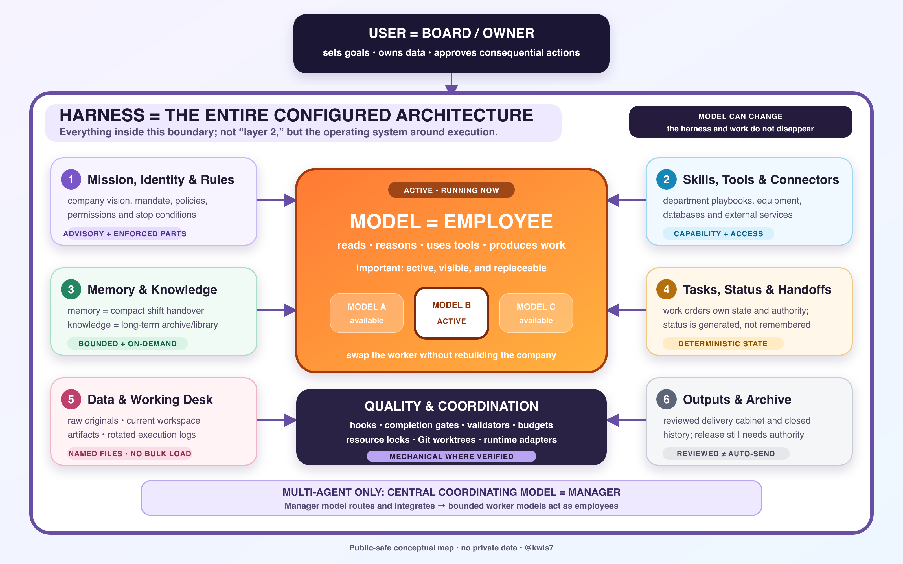

# Before the first task: how an agent works

In the venue exercise, an assistant must read three notes, compare the requirements, write a result and leave enough information to continue later. The model interprets the notes and proposes what to do. Other parts of the system make the notes available, perform file operations and retain the result. Understanding these contributions helps you decide which part needs attention when the work goes wrong.

This book uses **agent** for a role carried out through a model, instructions, working state, available tools and an execution loop. Implementations vary. An agent may work entirely within one session, without local files or other agents. We introduce files because they help preserve the work in this example, not because every agent must have a folder structure.

## Read the diagram as a working company

The company diagram separates responsibilities that can otherwise become confused. It shows the repository's complete design, including arrangements you may need only as the work grows. Begin by understanding the roles; you do not need to implement every box.



At the top, **you are the owner**. You choose the goal, control the materials and authorise consequential actions. For the venue task, that means specifying the workshop requirements and deciding whether anyone may contact a business. The **model**, shown as the active employee, interprets the supplied material and proposes responses or tool calls. Records, permissions and the model itself have separate roles in the design.

An **Agent is a working role**, such as a research assistant assigned to compare sources. Instructions define its assignment and boundaries, state records its progress, and tools supply the operations it can use. The same model can serve different roles in separate sessions with different context and permissions. A role can also be carried out by different models over time. Naming a role "Research Agent" does not train a separate model for it.

The **harness** is the configured working environment: rules, files, procedures, tools, state and checks. In the diagram, it and the active model form one system. If you replace the model, you can retain the records and methods around it. A change of runtime may nevertheless require different adapters and fresh verification. The persistent work gives you something to transfer; it does not make every tool interchangeable.

Other parts of the analogy help explain what to retain. A Skill resembles a playbook, a tool provides equipment, memory gives a short handover, and knowledge supplies reference material. A coordinating model has a management role when several responsibilities need routing or integration. That role has its own limits; it is neither required for a single task nor a higher source of authority.

The analogy describes responsibilities, without implying consciousness, loyalty, permanent memory or automatic access. Its quality controls also depend on implementation. A rule that says "do not send" guides behavior when read; software that blocks an unauthorised send enforces a boundary. The latter claim requires evidence that the corresponding control is implemented and works.

## Keep the core terms separate

| Term | Its job in the system |
|---|---|
| Model | Interprets supplied context and generates responses or proposed actions |
| Agent | Carries a role through instructions, state, tools, and an execution loop |
| Prompt | Communicates a request, instruction, or other material to the model |
| Skill | Packages a reusable procedure and supporting resources |
| Tool | Performs an operation, such as reading a file or running a calculation |
| Runtime | Hosts execution, supplies context, dispatches tools, and handles results |
| Harness | Configures the working environment around model execution |
| File | Stores information that can persist beyond a session |
| Context | The material actually available to the model for the current response |

One application may provide several of these functions, including execution, tools, storage and the interface. The terms help us describe what happens; they do not prescribe a separate product for every row.

The execution loop also differs from a fixed workflow. A fixed workflow follows a predefined sequence. In an agentic loop, the model can choose a subsequent step after receiving an observation, within the system's limits. A practical system may combine the two: a fixed review process can surround work in which the model chooses which file to read next. This distinction follows [Anthropic's explanation of workflows and agents](https://www.anthropic.com/engineering/building-effective-agents), without certifying any particular product's implementation.

## A prompt sets the task; a Skill carries a method

A task prompt might say, "Compare the supplied venues for 16 people after 18:00, with step-free entry required." It defines the immediate request. A durable rule such as "keep unsupported facts unknown" applies across a defined set of tasks. Both can influence the model when loaded, but one describes today's assignment and the other expresses a continuing instruction.

A **Skill** records a procedure you want to reuse. In this repository, its instructions are saved in `SKILL.md`, sometimes with examples, references or scripts alongside them. A source-comparison Skill could explain how to extract requirements, cite the relevant notes and handle missing fields. The next comparison can then use the same method without your having to write it again.

This is the sense in which a Skill **pins a useful prompt or method**: it gives the procedure a stable place where it can be discovered. The [Agent Skills specification](https://agentskills.io/specification) uses the name and description for initial discovery, with full instructions loaded when needed. Discovery and loading depend on the host. The document is not permanently active in every turn, and its filename does not make it a higher-priority system message.

When loaded, Skill instructions join the current context along with relevant rules, conversation and tool observations assembled by the runtime. Supplying this material changes the model's input, not its learned weights. It also leaves permissions unchanged. A script included with a Skill needs an actual execution tool and the relevant access; a procedure that mentions email neither connects an account nor authorises a send.

The difference is visible in the example. "Pick a venue" gives the model little basis for a judgment. The requirements, three source notes and comparison procedure give it evidence and a method to apply. That makes the work easier to evaluate, although the resulting comparison still needs review.

## Follow one execution loop

The first exercise requests a comparison of synthetic venue notes. It authorises no booking. The runtime supplies that task and relevant instructions; the model identifies the requirements and the evidence it needs. If the notes have not yet entered context, their filenames provide locations to read, not facts about the venues.

The model can request a file-read tool by naming an available operation and its arguments. The runtime applies its configured access policy and dispatches the allowed operation. The result may contain the file, a denial or an error. Saying "I read the file" is merely text; evidence of execution comes from the actual operation and its result.

Returned content enters the subsequent working context. The model can now compare the notes or request another permitted operation. This cycle of proposing an action, receiving an observation and using it in the next step is the execution loop. A wrong path, unavailable tool, denied permission or incomplete result can interrupt it. A successful operation can still be interpreted incorrectly.

Once the notes are available, Cedar Hall's recorded facts support the requirements, Willow Room's hours fail the evening condition, and Maple Studio's step-free entry remains unspecified. Further reasoning cannot produce the missing entrance statement. The assistant can draft an unsent clarification question as a later task; it has neither obtained the answer nor received permission to contact anyone.

The draft goes to `workspace/comparison.md`. After source review and any corrections, the checked result goes to `outputs/comparison.md`, and `workspace/handoff.md` records actual progress and remaining limits. A successful file write establishes that content was saved, not that it was correct. With a chat-only interface, the assistant can return text for you to save and must leave automatic writeback unclaimed.

Finally, the assistant reports what was achieved and what remains. When it lacks necessary information or authority, stopping with a clear handoff may be the correct outcome. Chapter 1 lets you observe this process in a task small enough to check yourself.

## What Markdown files actually do

The `.md` extension commonly denotes **Markdown**, a plain-text format you can edit in an ordinary text editor. A heading can begin with `#`, a list can use hyphens, and links can point to other files. This makes instructions and records accessible to you as well as to the assistant. You can inspect or revise the underlying text without depending on a particular AI application.

Filenames have effects only through the environment that uses them. A host may discover `AGENTS.md` as an instruction entrypoint or `SKILL.md` as a Skill entrypoint in an expected location. These conventions do not make the files universally executable. The project also uses names such as `RULES.md` and `workspace/handoff.md`; its workflow must arrange for the relevant contents to be read.

The following excerpts show how the same plain-text format can hold a request, a continuing rule, a procedure or current state. They are illustrations, not extra required files for the exercise or a complete installable Skill:

```text
task-brief.md
Compare the supplied venues for 16 people after 18:00.
Step-free entry is required.

RULES.md (illustrative project rule)
Keep missing source facts unknown; do not invent them.

skills/source-comparison/SKILL.md (illustrative procedure)
Check each requirement against each source and cite the evidence.

workspace/handoff.md (example state, only if actually true)
Draft saved at workspace/comparison.md; source review remains.
```

Consider the handoff in that example. Saving it preserves text in a **file**. Reading it into the next session supplies that text as **context**. Neither operation changes the **model weights**, the learned parameters used to generate responses. These are three different forms of state. A future session can resume because the relevant records are retrieved, not because the saved facts have permanently become part of the model.

## Personalise the work explicitly

Personalisation starts with a choice about your work. You may want a particular language, level of detail, evidence standard or form of review. Retaining a choice can save repeated prompting, provided you can see where it applies and change it later.

Suppose you tell the assistant, "For future source comparisons, lead with a short recommendation, then explain the evidence and unknowns." You have explicitly requested a continuing preference for comparison work. Its scope matters: that format may suit a research note and be unsuitable for a poem or debugging log. Record the request and its scope rather than inferring a general personality profile from the correction.

The exercise produces other information with different uses. "Maple's access remains unknown" belongs to current task state. A repeatable method for extracting, comparing, citing and reviewing can become a Skill. An explanation of how missing evidence differs from a negative answer can become a knowledge note. Keeping these uses separate makes it easier to retrieve what a task needs and retire what has become stale.

Personalisation therefore changes the information and procedures supplied to the model. It does not train the model automatically. Repeated use alone cannot establish a guessed preference, and ordinary corrections should not be used to infer sensitive traits. Retain appropriate, authorised material and periodically check that earlier choices still suit the work.

## Why build this alongside existing AI software?

If you use Codex, Claude Code or WorkBuddy, begin with the capabilities actually available there. The guide does not assume those products lack memory, Skills or workspace features. Use your chosen application's runtime, tools, instruction loading and storage. Building a personal system does not require writing another orchestration engine or custom application.

Your contribution is deciding how those capabilities serve your work: which role the assistant has, which authorised sources it uses, which preferences and methods apply, and which records explain the current result. The built-in arrangements may already be sufficient. Where they need supplementing, add something that solves an identifiable problem, such as recovering the evidence behind a report revision.

In this guide, **local** describes a durable workspace under your control. You can inspect its files, back them up and, where appropriate, keep versions that show what changed. Source attribution preserves the reasons for a conclusion, and a handoff helps another session recover the next step. A compatible tool can reuse the authorised material after its loading and saving behavior has been checked.

The location of these files does not determine where the model runs. A hosted model or connector may receive their contents during use, so privacy still depends on data flows, permissions, service settings and what you provide. A `.md` extension or folder name offers no privacy guarantee. Changing tools likewise requires testing how the new environment loads instructions and saves results.

This effort is most useful for recurring work, tasks that span sessions or results that need an inspectable evidence trail. Normal chat may be sufficient for a one-off explanation. A persistent workspace also needs care: instructions grow stale, copies diverge and procedures change. Begin with a useful task, then keep the parts that make its next occurrence easier. The [first-task chapter](01-first-task.md) gives you a small example to try.
